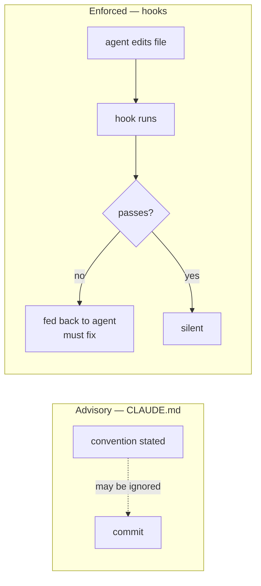

# Agent Guardrails

Permissions and hooks. This is the layer that stops an agent doing the wrong thing, as opposed to `CLAUDE.md`, which only tells it what the right thing is.

The distinction matters. Conventions are advisory — an agent deep in a debugging session violates them occasionally. Hooks are mechanical: they run whether or not the agent remembered the rule.



---

## Permissions

`.claude/settings.json` ships with an allowlist and a deny list. It's tracked in git — this is shared project configuration, not personal preference. Personal overrides go in `.claude/settings.local.json`, which is gitignored.

### What's allowed without asking

Everything on the list is either read-only or a project binstub whose behaviour is known:

- **Test, lint, scan** — `bin/test`, `bin/rubocop`, `bin/brakeman`
- **Safe Rails tasks** — `routes`, `db:migrate`, `db:prepare`, `db:test:prepare`, `db:seed`, `generate`, `about`, `stats`, `zeitwerk:check`, `tailwindcss:build`
- **Read-only git** — `status`, `log`, `diff`, `show`, `branch`, `remote -v`, plus `add`
- **Read-only gh** — `pr view/checks/diff/list`, `issue view/list`, `run list/view`
- **Search and inspection** — `ls`, `find`, `grep`, `rg`, `wc`, `head`, `tail`
- **Bundler** — `install`, `show`, `exec rubocop`

Without this, an agent asks permission for `bin/test` every session, dozens of times. The prompts train you to approve reflexively, which is worse than not prompting at all.

### What's explicitly denied

Deny rules are a hard block — not a prompt.

**Credentials stay out of the context window:**

```
Read(./config/master.key)
Read(./config/credentials/*.key)
Read(./.kamal/secrets)
Read(./.env)
Read(./.env.*)
```

An agent has no reason to read these, and anything that enters context can end up in a transcript, a bug report, or a pasted snippet.

**History-destroying git commands:**

```
Bash(git push --force:*)
Bash(git push -f:*)
Bash(git reset --hard:*)
Bash(git clean -fd:*)
```

### Deliberately not on either list

`bin/rails console`, `bin/rails runner`, `kamal deploy`, `rm`, and anything else destructive or arbitrary-code-executing. These prompt every time, which is correct — `runner` is arbitrary code execution wearing a Rails costume, and a deploy is outward-facing.

### Tuning it

Add project-specific commands to `.claude/settings.json` and commit them; the whole team benefits. Keep personal preferences in `.claude/settings.local.json`.

The rule of thumb: **allow it if you'd approve it every time without reading it.** If you'd want to read the command first, leave it prompting.

---

## Hooks

Two hook scripts, both plain Ruby in `bin/hooks/`, both readable and editable.

Claude Code passes the tool call as JSON on stdin. Exit 0 is silent success; **exit 2 sends stderr back to the agent as feedback it has to address.** Both scripts exit 0 on any unexpected error — a broken hook must never block work.

### `bin/hooks/post_edit` — after every Edit/Write

**Ruby files** (`.rb`, `.rake`) run through `bin/rubocop --force-exclusion`. Failures come back to the agent with the offences and the autocorrect command. This is the highest-value hook: RuboCop cleanliness is a stated convention that agents drift from, and catching it at write time costs nothing.

**Slim templates** (`.slim`) are checked for Tailwind bracket classes in the shorthand form:

```slim
.max-h-[85vh]              # Slim parses [ as attribute syntax — breaks
div class="max-h-[85vh]"   # correct
```

`CLAUDE.md` documents this pitfall, but it's the single most common Slim mistake and it fails at render time rather than write time. The hook catches it immediately.

### `bin/hooks/session_end` — when the agent finishes a turn

Scans the doc canon for `Status: Draft` placeholders and reports any it finds.

`/feature_plan` creates placeholders and `/pr_submit` is meant to complete or delete them, but a session ending in between leaves them silently — and `WORKFLOW.md` forbids merging a PR with a Draft placeholder behind it. The hook stays quiet unless there's something to report.

### Turning them off

Remove the relevant entry from `.claude/settings.json`. The scripts are ordinary files; delete them too if you don't want them.

**If hooks become noise, disable them.** A hook that fires constantly gets ignored, then disabled, and takes the useful ones with it. The three shipped here were chosen to be quiet: two fire only on relevant file types, one only when there's a real problem.

### Adding your own

Match the existing shape — read JSON from stdin, exit 0 for silence, exit 2 with a clear message for feedback, exit 0 on any internal error.

Good candidates as a project grows: blocking commits when the suite hasn't run, checking for `binding.pry` left in committed code, verifying migrations have indexes. Add them one at a time and delete any that turn out to be noisy.

---

## Who may invoke what

The third guardrail is not a setting. A command is a markdown file, so an agent in a session can follow one without being asked, and for some of these that is useful: `/run_lint`, `/test_fix`, `/rails_code_review`, and `/pr_fix_ci` read the repo and edit locally, and nothing leaves the machine. The other fifteen post a review, push a branch, move a board item, or stand at one of the four gates, and those stay the human's to invoke — a gate with an agent on both sides is not a gate.

The generated app's `WORKFLOW.md` states the split per command, with the reason, under "Who invokes what". It is prose rather than a flag because the harness has no per-command invocation switch; a real handoff would need a subagent definition, which the template does not ship yet.

## What this does not do

Guardrails reduce the blast radius; they don't remove the need to review. An agent can still write logically wrong code that lints perfectly, and permissions constrain which commands run, not whether the change is correct.

Read the diff.
