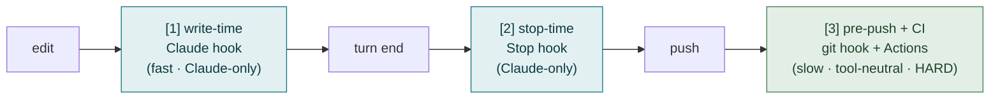
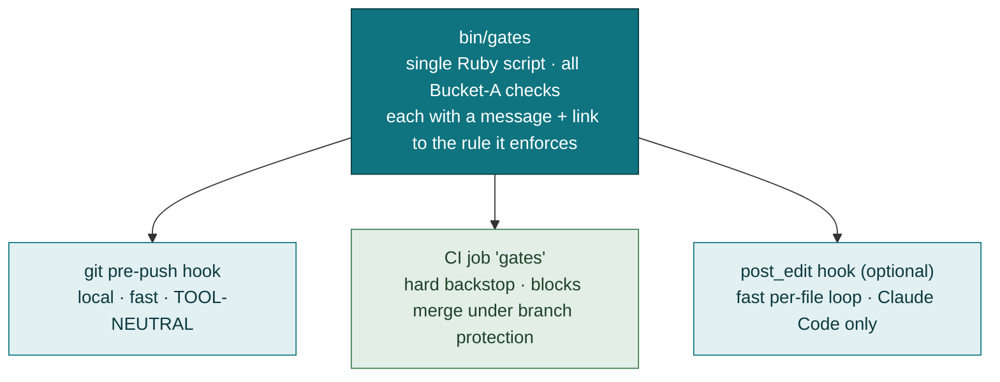
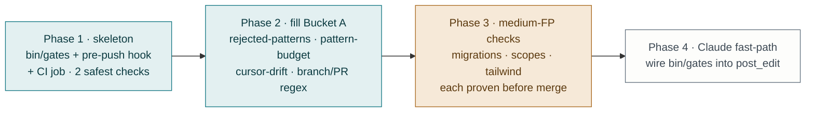

# Deterministic Gates — Design

**Status: Draft** — proposal for review, no code yet.

A working document for deciding which rules and workflow steps can be enforced
*mechanically* rather than by prompt, where the enforcement should attach, and
in what order to build it. Written to be argued with, not as marketing.

The premise: an agent will eventually miss a rule or skip a workflow step. The
alignment layer today ([`CLAUDE.md`](../templates/CLAUDE.md.tt) +
[38 rules](../templates/docs/rules/INDEX.md) in web mode + [`WORKFLOW.md`](../templates/WORKFLOW.md))
tells an agent what to do; with three narrow exceptions, nothing *checks* that it
did. This doc scopes the checking layer.

---

## 1. What's already enforced

A generated app ships four deterministic layers. They cover a small slice of the
rule corpus, and all but one are Claude-Code-specific.

| Layer | Fires when | Covers today | Tool-neutral? |
|---|---|---|---|
| [`bin/hooks/post_edit`](../templates/bin/hooks/post_edit) (PostToolUse) | file edited | RuboCop on `.rb`/`.rake`, Slim bracket-class footgun on `.slim` | ❌ Claude Code only |
| [`bin/hooks/session_end`](../templates/bin/hooks/session_end) (Stop) | turn ends | `Status: Draft` doc placeholders | ❌ Claude Code only |
| [`.claude/settings.json`](../templates/.claude/settings.json) deny list | tool call | force-push, `reset --hard`, `clean -fd`, reading secrets | ❌ Claude Code only |
| Rails 8 default `ci.yml` + branch protection | push / PR | `scan_ruby`, `scan_js`, `lint` (RuboCop), `test` | ✅ any agent |

Net: of **38 rules and 4 workflow gates (G1–G4)** in web mode, exactly **three rules** have a
deterministic backstop — the two RuboCop-and-Slim checks in `post_edit` and the
Draft-placeholder check in `session_end`. Everything else is prose. The
[inventory](inventory.md) states the problem plainly: *"the alignment layer was
entirely advisory… Conventions drift under pressure. This reduces divergence; it
doesn't eliminate it."*

---

## 2. The criterion — already written in the repo

The template contains its own gate-ability test. It is the third of the three
bars a pattern must clear in
[`pattern-budget`](../templates/docs/rules/pattern-budget.md):

> *"A reviewer can check it in a diff. If nobody can tell whether the rule was
> followed, it isn't a rule, it's a mood."*

**A rule can become a deterministic gate if and only if it clears that same bar.**
The gate corpus is therefore a *subset* of the rule corpus, and the boundary is
already drawn. The design work is not inventing checks — it is sorting the
existing rules by whether a machine can tell.

Corollary, and the load-bearing constraint of this whole doc: a check that fires
*wrongly* is worse than no check. A false positive gets the gate disabled, worked
around, or `--no-verify`'d, and it trains the agent (and the human) that gates
are noise — which poisons the true gates alongside it. `agent-guardrails.md`
already states this operationally: *"A hook that fires constantly gets ignored,
then disabled, and takes the useful ones with it."* Every proposal below is
ranked by false-positive risk first, value second.

---

## 3. Three attachment points

"A gate" is not one thing. There are three places to attach one, trading feedback
speed against coverage. The same violation can be caught at any of them; the
question is how early, and for which agents.

- **[1] Write-time (Claude PostToolUse hook)** — instant, in-loop correction; the
  agent fixes before it moves on. But *only Claude Code sees it.* Cursor, Codex,
  and a human get nothing.
- **[2] Stop-time (Claude Stop hook)** — catches state left dirty at turn end
  (the Draft-placeholder case). Also Claude-only.
- **[3] Pre-push git hook + CI** — the only **tool-neutral** layer, and the only
  place a gate can be genuinely **hard**. It doesn't depend on the agent
  cooperating, which is the entire point when "the agent missed the rule."

The structural gap this exposes: **every enforcement layer today except CI is
Claude-Code-specific.** A Cursor or Codex agent — which the template
[explicitly supports](../templates/AGENTS.md) — gets *zero* local enforcement;
its first feedback is a red CI run minutes after the push. The missing piece is a
**git `pre-push` hook**, because it is the only mechanism that is both *local*
(fast) and *tool-neutral* (any agent, any human). The template ships none. This
is the highest-leverage single addition in the doc.

---

## 4. Bucketing the corpus

Every rule and workflow gate sorted by whether a machine can check it. This table
*is* the design — building follows from it.

### Bucket A — mechanically checkable (grep / existence / regex)

Hard gates buildable today, ordered by false-positive risk (lowest first).

| Rule / gate | Check | FP risk | Notes |
|---|---|---|---|
| [`rejected-patterns`](../templates/docs/rules/rejected-patterns.md) | grep for `accepts_nested_attributes_for`, `app/repositories/`, `app/interactors/`, `SimpleDelegator`, `Dry::` | ~0 | The rule ships its own trigger list in frontmatter. A hit is unambiguous. `app/serializers/` is **not** on this list: it is rejected in server-rendered mode and sanctioned in API mode, so the check has to read the mode first. |
| [`pattern-budget`](../templates/docs/rules/pattern-budget.md) (no extra `app/` dir) | `Dir.children("app")` vs the mode's allowlist — six directories in server-rendered mode, seven in API mode; a new dir needs a matching ADR | ~0 | Deliberately excludes judgment ("is this the right pattern") — only the directory count. Mode comes from `config.api_only`. |
| `.cursor/commands` drift ([inventory gap 9](inventory.md)) | `diff -r .claude/commands .cursor/commands` | ~0 | The two dirs are mirrored at generation; nothing stops post-hoc drift. |
| Branch name / PR title format | regex: branch `prefix/n/slug`, PR title `PREFIX \| n \| description` | low | Tier-aware (`beads` uses bead IDs). Wizard already knows the prefixes. |
| [`database-conventions`](../templates/docs/rules/database-conventions.md) (primary keys) | new `create_table` in `db/migrate/` lacking `id: :uuid` | low | PostgreSQL apps only — on MySQL the absence of `id: :uuid` is correct, so the gate has to read the adapter from `config/database.yml` first. Scope to new migrations; never re-scan existing schema. |
| [`safe-migrations`](../templates/docs/rules/safe-migrations.md) | `add_index` without `algorithm: :concurrently` + `disable_ddl_transaction!` | medium | Genuinely fine for a brand-new table; needs a "table pre-exists" heuristic or it false-positives on greenfield migrations. |
| [`scopes`](../templates/docs/rules/scopes.md) (no class methods returning relations) | `def self.*` in `app/models/**` whose body returns `where`/`all`/`joins` | medium | Static return-type inference is heuristic; risk of both misses and false hits. |
| [`tailwind-build`](../templates/docs/rules/tailwind-build.md) (interpolated classes purged) | class-string interpolation in `app/javascript/**` | medium | Legitimate uses exist; needs care. |
| [`audit-trail`](../templates/docs/rules/audit-trail.md) | `has_paper_trail` present without `only:` | medium | Enforces the scoping habit, not correctness. |
| [`openapi-contract`](../templates/docs/rules/openapi-contract.md) (API mode) | `bin/rails api:contract:check` — regenerate from the request tests and diff against the committed `openapi.yaml` | ~0 | **Built, and the only gate here that is.** Exits 1 on drift. Ships as a generated workflow with a service container matching the database family. An endpoint with no request test records nothing, so it cannot be documented without one. |
| [`error-envelope`](../templates/docs/rules/error-envelope.md) (API mode) | `assert_problem` in a request test: content type, `type`, `status` matching the status line, `title` present, and no `success` key | ~0 | Not a static check — it runs where the response actually exists. One line per assertion at the call site. |

### Bucket B — checkable only dynamically (test-time)

Not new gate mechanisms — these are rules whose enforcement *is a test*, already
runnable in the existing suite / CI. The gate is "a test asserting this exists."

| Rule | How it's already checkable |
|---|---|
| [`n-plus-one`](../templates/docs/rules/n-plus-one.md) | Bullet, raising in test env |
| [`turbo-status`](../templates/docs/rules/turbo-status.md) | controller test asserts 422 on validation failure |
| [`accessibility`](../templates/docs/rules/accessibility.md) | Lighthouse CI ([`lighthouse.yml`](../templates/.github/workflows/lighthouse.yml)) + component tests |
| [`testing`](../templates/docs/rules/testing.md) (suite speed) | Slowpoke, already on by default |

The lever here is not a new gate but **requiring the test to exist** — a Bucket-A
check that greps for the assertion is possible but high false-positive; more
honest to leave these to review + the dynamic tools already shipped.

### Bucket C — un-gateable, stays advisory

Judgment calls. No mechanical check can decide them, and a heuristic that tries
will false-positive its way to being disabled.

`service-objects`, `form-objects`, `query-objects`, `policy-objects`,
`registries`, `write-path`, `view-code-placement`, `optional-patterns`,
`callbacks`, `caching`, `stimulus`, `components`, `partials`,
`current-attributes`, and the human gates **G1 (design approved)** / **G2 (plan
approved)** — a design doc being *good* is not machine-decidable. These remain
prose in [`docs/rules/`](../templates/docs/rules/INDEX.md) and are caught, if at
all, by [`/pr_review`](../templates/.claude/commands) and a human reading the diff.

Promoting a Bucket-C rule into a gate is the failure mode to avoid, however
tempting the heuristic.

---

## 5. Architecture — one script, three triggers

The repo's governing convention is *one fact, one file*. The gate logic obeys it:
a single check script, called from each of the three attachment points. No check
is written twice.

- **`bin/gates`** — plain Ruby, same shape as the existing hooks: readable,
  editable, one check per method, each printing the offending path plus a link
  back to the rule file it enforces. Accepts a file list (for the fast path) or
  scans the diff against the base branch (for pre-push / CI).
- **`pre-push` git hook** — installed by `template.rb`, opt-in. The tool-neutral
  local gate. Bypassable with `git push --no-verify` so a human is never wedged.
- **CI job `gates`** — a new workflow (the Rails-default `ci.yml` is generated,
  not in the repo, so this is a separate file, mirroring how
  [`lighthouse.yml`](../templates/.github/workflows/lighthouse.yml) is added).
  Fails closed. Becomes a hard merge gate when branch protection requires it.
- **`post_edit`** — optionally also call `bin/gates` for the single edited file,
  giving Claude Code the in-loop correction. Belt-and-suspenders, not load-bearing.

---

## 6. Tensions to resolve before building

Three real conflicts, each needing an explicit decision.

**1. "A broken hook must never block work" vs. a gate that must block.** Every
current hook exits 0 on internal error — deliberately, so a bug in a hook can't
wedge the agent. A *hard* gate is the opposite: it must fail closed. These cannot
coexist in one mechanism. **Resolution:** layer the exit-code policy by trigger.
`bin/gates` run from `post_edit` / `pre-push` fails *soft* on its own internal
errors (a check that crashes exits 0), but fails the *push* on a genuine
violation it successfully detected. Run from CI it fails closed on both. Same
script, two policies, selected by an env flag or invocation mode.

**2. False positives train bypass.** Covered in §2 — it is the reason the build
order below ships only the ~0-FP checks first and proves them on a generated app
before adding the medium-risk ones. A gate earns trust by never crying wolf.

**3. Tool-neutrality vs. the harness exception.** The repo rule is *no
harness-specific loading anywhere in `templates/`*. Hooks in `.claude/` are
already an accepted exception — they are *additive* enforcement, never the source
of truth. This doc keeps that discipline: the durable gate lives in
**pre-push + CI** (tool-neutral); the Claude hook is only an accelerant. If the
Claude hook were the only enforcement, the product's promise — *works in Claude
Code, Cursor, Codex, and a human with `grep`* — would have a hole exactly where
enforcement matters most.

**4. Tier interaction.** The workflow gates are tier-aware
([`github-projects` / `beads` / `labels`](../templates/WORKFLOW.md)). Branch/PR
regex checks must read the resolved `{{TRACKER}}` token — a `beads` bead ID is
not a GitHub issue number, and `beads` PRs must *not* carry `Closes #n`. Any
name-format gate is parameterized by the wizard, not hardcoded.

---

## 7. Build order

Leverage-to-cost, safest first. Each phase is independently shippable and
verified by generating an app.

1. **Skeleton (~2h).** `bin/gates` with the wiring and the two lowest-risk checks
   (`rejected-patterns`, `.cursor/commands` drift). Ship the `pre-push` hook via
   `template.rb` and the CI `gates` job. Proves the three-trigger architecture
   end to end on a generated app.
2. **Fill Bucket A's safe tier (~2h).** Add `pattern-budget` and the branch/PR
   name regex (tier-aware). All ~0-FP or low-FP.
3. **Medium-FP checks, one at a time (~1h each).** `safe-migrations`,
   `database-conventions`, `scopes`, `tailwind-build`, `audit-trail`. Each proven
   on a generated app for false positives *before* merge; drop any that can't be
   made quiet. Follows the `agent-guardrails.md` doctrine: *"Add them one at a
   time and delete any that turn out to be noisy."*
4. **Claude fast-path (~30m).** Call `bin/gates` from `post_edit` for the edited
   file, giving Claude Code in-loop correction. Optional accelerant.

Bucket B stays with the dynamic tools already shipped. Bucket C stays prose.

---

## 8. What this does not do

Same honesty as [`agent-guardrails.md`](agent-guardrails.md): gates reduce the
blast radius; they don't remove review. An agent can still write logically wrong
code that passes every mechanical check — the gates decide *shape and process
conformance*, not correctness. The un-gateable two-thirds of the corpus (Bucket C)
is exactly the part that most needs a human to read the diff. Gates buy back the
attention a reviewer would otherwise spend on the mechanical third.

---

## Cross-references

- [`agent-guardrails.md`](agent-guardrails.md) — the existing enforcement layer this extends
- [`inventory.md`](inventory.md) — shipped/absent status; gap 9 (cursor-drift) folds in here
- [`../templates/WORKFLOW.md`](../templates/WORKFLOW.md) — the four workflow gates and tier model
- [`../templates/docs/rules/INDEX.md`](../templates/docs/rules/INDEX.md) — the 37-rule corpus being bucketed
- [`../templates/docs/rules/pattern-budget.md`](../templates/docs/rules/pattern-budget.md) — the gate-ability criterion
