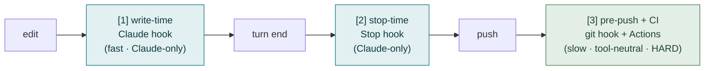
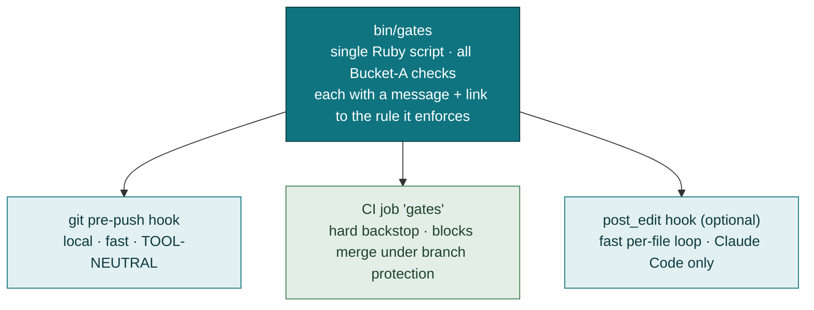
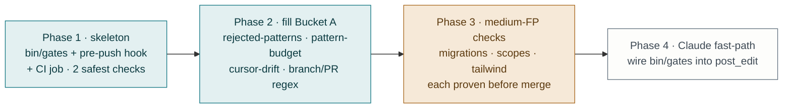

# Deterministic Gates — Design

**Status: Phase 1 built** — `bin/gates`, the pre-push hook and the CI job ship with the three zero-false-positive checks. Phases 2–4 below are still proposals.

A working document for deciding which rules and workflow steps can be enforced
*mechanically* rather than by prompt, where the enforcement should attach, and
in what order to build it. Written to be argued with, not as marketing.

The premise: an agent will eventually miss a rule or skip a workflow step. The
alignment layer today ([`CLAUDE.md`](../templates/CLAUDE.md.tt) +
[38 rules](../templates/docs/rules/INDEX.md) in web mode + [`WORKFLOW.md`](../templates/WORKFLOW.md))
tells an agent what to do; with three narrow exceptions, nothing *checks* that it
did. This doc scopes the checking layer.

---

## 1. What's already enforced

A generated app ships five deterministic layers. They cover a small slice of the
rule corpus, and three of the five are Claude-Code-specific.

| Layer | Fires when | Covers today | Tool-neutral? |
|---|---|---|---|
| [`bin/hooks/post_edit`](../templates/bin/hooks/post_edit) (PostToolUse) | file edited | RuboCop on `.rb`/`.rake`, Slim bracket-class footgun on `.slim` | ❌ Claude Code only |
| [`bin/hooks/session_end`](../templates/bin/hooks/session_end) (Stop) | turn ends | `Status: Draft` doc placeholders | ❌ Claude Code only |
| [`.claude/settings.json`](../templates/.claude/settings.json) deny list | tool call | force-push, `reset --hard`, `clean -fd`, reading secrets | ❌ Claude Code only |
| Rails 8 default `ci.yml` + branch protection | push / PR | `scan_ruby`, `scan_js`, `lint` (RuboCop), `test` | ✅ any agent |
| [`bin/gates`](../templates/bin/gates) via `pre-push` + [`gates.yml`](../templates/.github/workflows/gates.yml) | push / PR | rejected-pattern tokens, `app/` directory budget, `.cursor/commands` mirror | ✅ any agent |

Net: of **38 rules and 4 workflow gates (G1–G4)** in web mode, **five rules** have a
deterministic backstop — the two RuboCop-and-Slim checks in `post_edit`, the
Draft-placeholder check in `session_end`, and `rejected-patterns` and
`pattern-budget` in `bin/gates`. Everything else is prose. The
[inventory](inventory.md) states the problem plainly: *"the alignment layer was
entirely advisory… Conventions drift under pressure. This reduces divergence; it
doesn't eliminate it."*

---

## 2. The criterion — already written in the repo

The template contains its own gate-ability test. It is the third of the three
bars a pattern must clear in
[`pattern-budget`](../templates/docs/rules/pattern-budget.md):

> *"A reviewer can check it in a diff. If nobody can tell whether the rule was
> followed, it isn't a rule, it's a mood."*

**A rule can become a deterministic gate if and only if it clears that same bar.**
The gate corpus is therefore a *subset* of the rule corpus, and the boundary is
already drawn. The design work is not inventing checks — it is sorting the
existing rules by whether a machine can tell.

Corollary, and the load-bearing constraint of this whole doc: a check that fires
*wrongly* is worse than no check. A false positive gets the gate disabled, worked
around, or `--no-verify`'d, and it trains the agent (and the human) that gates
are noise — which poisons the true gates alongside it. `agent-guardrails.md`
already states this operationally: *"A hook that fires constantly gets ignored,
then disabled, and takes the useful ones with it."* Every proposal below is
ranked by false-positive risk first, value second.

---

## 3. Three attachment points

"A gate" is not one thing. There are three places to attach one, trading feedback
speed against coverage. The same violation can be caught at any of them; the
question is how early, and for which agents.



- **[1] Write-time (Claude PostToolUse hook)** — instant, in-loop correction; the
  agent fixes before it moves on. But *only Claude Code sees it.* Cursor, Codex,
  and a human get nothing.
- **[2] Stop-time (Claude Stop hook)** — catches state left dirty at turn end
  (the Draft-placeholder case). Also Claude-only.
- **[3] Pre-push git hook + CI** — the only **tool-neutral** layer, and the only
  place a gate can be genuinely **hard**. It doesn't depend on the agent
  cooperating, which is the entire point when "the agent missed the rule."

The structural gap this exposes: **every enforcement layer today except CI is
Claude-Code-specific.** A Cursor or Codex agent — which the template
[explicitly supports](../templates/AGENTS.md.tt) — gets *zero* local enforcement;
its first feedback is a red CI run minutes after the push. The missing piece is a
**git `pre-push` hook**, because it is the only mechanism that is both *local*
(fast) and *tool-neutral* (any agent, any human). Phase 1 shipped it as
`bin/hooks/pre-push`; it was the highest-leverage single addition in the doc.

---

## 4. Bucketing the corpus

Every rule and workflow gate sorted by whether a machine can check it. This table
*is* the design — building follows from it.

### Bucket A — mechanically checkable (grep / existence / regex)

Hard gates buildable today, ordered by false-positive risk (lowest first).

| Rule / gate | Check | FP risk | Notes |
|---|---|---|---|
| [`rejected-patterns`](../templates/docs/rules/rejected-patterns.md) | grep `app/**/*.rb` for `accepts_nested_attributes_for`, `SimpleDelegator`, `Dry::`, `Interactor`, and the Gemfile for `dry-*` / `interactor` | ~0 | **Built** in `bin/gates`. The rule's frontmatter triggers are prose, so the token list lives in the script. `app/repositories/` and `app/interactors/` fall to the pattern-budget check below. `app/serializers/` is **not** a token: it is rejected in server-rendered mode and sanctioned in API mode, so only the directory check, which reads the mode, can judge it. |
| [`pattern-budget`](../templates/docs/rules/pattern-budget.md) (no extra `app/` dir) | `Dir.children("app")` vs the mode's allowlist — six directories in server-rendered mode, seven in API mode; a new dir needs a matching ADR | ~0 | **Built** in `bin/gates`. Deliberately excludes judgment ("is this the right pattern") — only the directory count. Mode comes from `config.api_only`; a directory an ADR in `docs/adr/` names is allowed. |
| `.cursor/commands` drift ([inventory gap 14](inventory.md)) | `diff -r .claude/commands .cursor/commands` | ~0 | **Built** in `bin/gates`. The two dirs are mirrored at generation; nothing else stops post-hoc drift. |
| Branch name / PR title format | regex: branch `prefix/n/slug`, PR title `PREFIX \| n \| description` | low | Tier-aware (`beads` uses bead IDs). Wizard already knows the prefixes. |
| [`database-conventions`](../templates/docs/rules/database-conventions.md) (primary keys) | new `create_table` in `db/migrate/` lacking `id: :uuid` | low | PostgreSQL apps only — on MySQL the absence of `id: :uuid` is correct, so the gate has to read the adapter from `config/database.yml` first. Scope to new migrations; never re-scan existing schema. |
| [`safe-migrations`](../templates/docs/rules/safe-migrations.md) | `add_index` without `algorithm: :concurrently` + `disable_ddl_transaction!` | medium | Genuinely fine for a brand-new table; needs a "table pre-exists" heuristic or it false-positives on greenfield migrations. |
| [`scopes`](../templates/docs/rules/scopes.md) (no class methods returning relations) | `def self.*` in `app/models/**` whose body returns `where`/`all`/`joins` | medium | Static return-type inference is heuristic; risk of both misses and false hits. |
| [`tailwind-build`](../templates/docs/rules/tailwind-build.md) (interpolated classes purged) | class-string interpolation in `app/javascript/**` | medium | Legitimate uses exist; needs care. |
| [`audit-trail`](../templates/docs/rules/audit-trail.md) | `has_paper_trail` present without `only:` | medium | Enforces the scoping habit, not correctness. |
| [`openapi-contract`](../templates/docs/rules/openapi-contract.md) (API mode) | `bin/rails api:contract:check` — regenerate from the request tests and diff against the committed `openapi.yaml` | ~0 | **Built.** Exits 1 on drift. Ships as a generated workflow with a service container matching the database family. An endpoint with no request test records nothing, so it cannot be documented without one. |
| [`error-envelope`](../templates/docs/rules/error-envelope.md) (API mode) | `assert_problem` in a request test: content type, `type`, `status` matching the status line, `title` present, and no `success` key | ~0 | Not a static check — it runs where the response actually exists. One line per assertion at the call site. |
| **Query ledger** — every query shape the suite emits from `app/` has a committed, reviewed entry | `bin/rails db:queries:check`: record normalized SQL during the test run, fail on a fingerprint absent from `db/queries.yml` or present with an empty `review:` | ~0 | The gate checks presence in a file, not plan quality, which is what keeps it at ~0. The review it forces is where EXPLAIN happens. Design in [§8](#8-design-the-query-ledger). Not built. |
| Unindexed foreign keys | every column an `add_foreign_key` in `db/schema.rb` names appears in some index on that table | ~0 | Static, schema only. `t.references` indexes by default, so hits are rare and always real. A `bin/gates` check, not a suite run. Not built. |

### Bucket B — checkable only dynamically (test-time)

Not new gate mechanisms — these are rules whose enforcement *is a test*, already
runnable in the existing suite / CI. The gate is "a test asserting this exists."

| Rule | How it's already checkable |
|---|---|
| [`n-plus-one`](../templates/docs/rules/n-plus-one.md) | Bullet, raising in test env |
| [`turbo-status`](../templates/docs/rules/turbo-status.md) | controller test asserts 422 on validation failure |
| [`accessibility`](../templates/docs/rules/accessibility.md) | Lighthouse CI ([`lighthouse.yml`](../templates/.github/workflows/lighthouse.yml)) + component tests |
| [`testing`](../templates/docs/rules/testing.md) (suite speed) | Slowpoke, already on by default |

The lever here is not a new gate but **requiring the test to exist** — a Bucket-A
check that greps for the assertion is possible but high false-positive; more
honest to leave these to review + the dynamic tools already shipped.

### Bucket C — un-gateable, stays advisory

Judgment calls. No mechanical check can decide them, and a heuristic that tries
will false-positive its way to being disabled.

`service-objects`, `form-objects`, `query-objects`, `policy-objects`,
`registries`, `write-path`, `view-code-placement`, `optional-patterns`,
`callbacks`, `caching`, `stimulus`, `components`, `partials`,
`current-attributes`, and the human gates **G1 (design approved)** / **G2 (plan
approved)** — a design doc being *good* is not machine-decidable. These remain
prose in [`docs/rules/`](../templates/docs/rules/INDEX.md) and are caught, if at
all, by [`/pr_review`](../templates/.claude/commands) and a human reading the diff.

Add to that list **query plan quality** — "this query uses an index", "this query
is optimized". A test database holds a few hundred rows, and on a few hundred rows
the planner picks a sequential scan and is right to. A gate reading `EXPLAIN`
output for `Seq Scan` would fire on every small table in every PR, which is the
false-positive machine §2 warns about. What *can* be gated is whether anyone
looked: §8.

Promoting a Bucket-C rule into a gate is the failure mode to avoid, however
tempting the heuristic.

---

## 5. Architecture — one script, three triggers

The repo's governing convention is *one fact, one file*. The gate logic obeys it:
a single check script, called from each of the three attachment points. No check
is written twice.



- **`bin/gates`** — plain Ruby, same shape as the existing hooks: readable,
  editable, one check per method, each printing the offending path plus a link
  back to the rule file it enforces. Accepts a file list (for the fast path) or
  scans the diff against the base branch (for pre-push / CI).
- **`pre-push` git hook** — installed by `template.rb`, opt-in. The tool-neutral
  local gate. Bypassable with `git push --no-verify` so a human is never wedged.
- **CI job `gates`** — a new workflow (the Rails-default `ci.yml` is generated,
  not in the repo, so this is a separate file, mirroring how
  [`lighthouse.yml`](../templates/.github/workflows/lighthouse.yml) is added).
  Fails closed. Becomes a hard merge gate when branch protection requires it.
- **`post_edit`** — optionally also call `bin/gates` for the single edited file,
  giving Claude Code the in-loop correction. Belt-and-suspenders, not load-bearing.

---

## 6. Tensions to resolve before building

Three real conflicts, each needing an explicit decision.

**1. "A broken hook must never block work" vs. a gate that must block.** Every
current hook exits 0 on internal error — deliberately, so a bug in a hook can't
wedge the agent. A *hard* gate is the opposite: it must fail closed. These cannot
coexist in one mechanism. **Resolution:** layer the exit-code policy by trigger.
`bin/gates` run from `post_edit` / `pre-push` fails *soft* on its own internal
errors (a check that crashes exits 0), but fails the *push* on a genuine
violation it successfully detected. Run from CI it fails closed on both. Same
script, two policies, selected by an env flag or invocation mode.

**2. False positives train bypass.** Covered in §2 — it is the reason the build
order below ships only the ~0-FP checks first and proves them on a generated app
before adding the medium-risk ones. A gate earns trust by never crying wolf.

**3. Tool-neutrality vs. the harness exception.** The repo rule is *no
harness-specific loading anywhere in `templates/`*. Hooks in `.claude/` are
already an accepted exception — they are *additive* enforcement, never the source
of truth. This doc keeps that discipline: the durable gate lives in
**pre-push + CI** (tool-neutral); the Claude hook is only an accelerant. If the
Claude hook were the only enforcement, the product's promise — *works in Claude
Code, Cursor, Codex, and a human with `grep`* — would have a hole exactly where
enforcement matters most.

**4. Tier interaction.** The workflow gates are tier-aware
([`github-projects` / `beads` / `labels`](../templates/WORKFLOW.md)). Branch/PR
regex checks must read the resolved `{{TRACKER}}` token — a `beads` bead ID is
not a GitHub issue number, and `beads` PRs must *not* carry `Closes #n`. Any
name-format gate is parameterized by the wizard, not hardcoded.

---

## 7. Build order

Leverage-to-cost, safest first. Each phase is independently shippable and
verified by generating an app.



1. ✅ **Skeleton.** `bin/gates` with the three ~0-FP checks (`rejected-patterns`,
   `pattern-budget`, `.cursor/commands` drift), the `pre-push` hook installed by
   `adopt.rb` through `core.hooksPath`, and the CI `gates` job. Whole-tree scans,
   no diff mode yet. Building it corrected two assumptions: `rejected-patterns`'
   frontmatter triggers are prose, not grep tokens, so the token list lives in
   the script; and a PR title cannot be checked at pre-push time, only in CI.
2. **Branch name regex (~1h).** Tier-aware, reading `{{BRANCH_PREFIX}}` and
   `{{TRACKER}}` from `.claude/workflow.config.md`, which `/workflow_setup`
   already writes. PR title is CI-only, from the event payload.
3. **Medium-FP checks, one at a time (~1h each).** `safe-migrations`,
   `database-conventions`, `scopes`, `tailwind-build`, `audit-trail`. Each proven
   on a generated app for false positives *before* merge; drop any that can't be
   made quiet. Follows the `agent-guardrails.md` doctrine: *"Add them one at a
   time and delete any that turn out to be noisy."*
4. **Claude fast-path (~30m).** Call `bin/gates` from `post_edit` for the edited
   file, giving Claude Code in-loop correction. Optional accelerant.
5. **Query ledger (~half a day).** The one Bucket-A gate that needs a database and
   a suite run, so it is its own CI job rather than a `bin/gates` check. Design
   below; the unindexed-foreign-key check rides along as a `bin/gates` method.

Bucket B stays with the dynamic tools already shipped. Bucket C stays prose.

---

## 8. Design: the query ledger

**Status: Draft** — design for review, nothing built. The conclusion of the
EXPLAIN question: a gate cannot decide that a query is *good*, but it can decide
that a query was *looked at*, and it can make looking cheap.

### What it is

`db/queries.yml` is a committed list of every distinct SQL shape the test suite
emits from application code, each with a one-line `review:` written by a person
or an agent after reading its plan. It is a build output with a human column: the
list is generated, the review lines are kept across regenerations, and CI fails
when a query shape exists that the file does not know.

```yaml
- sql: SELECT "orders".* FROM "orders" WHERE "orders"."user_id" = ? ORDER BY "orders"."created_at" DESC
  from: app/models/user.rb
  review: index_orders_on_user_id_and_created_at
- sql: SELECT "users".* FROM "users" WHERE "users"."admin" = ?
  from: app/queries/admin_roster.rb
  review: "no index: boolean over a table that stays small, revisit at 50k users"
```

It is the same mechanism as the API contract
([ADR 0013](../templates/docs/adr/0013-the-api-contract-is-generated-from-its-tests.md)):
generated from the tests, committed, `check` fails on drift. An untested query
records nothing, which is the same property — it cannot be reviewed without a
test, so the pressure to review becomes pressure to test.

### Why this and not EXPLAIN in CI

Bullet already answers "is this query repeated per row". The question it cannot
answer is "should this query exist in this shape at all", and neither can a
machine: the answer depends on cardinality, growth, and what else touches the
table. What a machine *can* hold is the fact that someone answered it once and
wrote the answer down next to the query. The `review:` line is that record. The
plan itself is not stored — a plan from a development database is a hint, not a
fact, and would drift with every fixture change.

### Mechanism

Four pieces, mirroring the API contract's shape file for file.

1. **Recorder** — `test/support/query_ledger.rb`. Inert unless `QUERY_LEDGER_OUT`
   is set. Subscribes to `sql.active_record`, keeps a query only if its cleaned
   backtrace has a frame under `app/` (which drops fixtures, schema loads, Solid
   Queue's own traffic and the framework's `SELECT 1`), normalizes it, and
   appends one JSON line: `sql`, first `app/` frame with the line number removed.
2. **Normalizer** — the identity of a query is its shape. PostgreSQL already binds
   as `$1`; MySQL and Trilogy inline literals. Both go through the same regex
   pass: numeric and quoted literals become `?`, runs of `?, ?, ?` collapse to
   `?`, whitespace collapses. The database family is read the way `adopt.rb`
   reads it, from `config/database.yml`.
3. **Tasks** — `lib/tasks/query_ledger.rake`.
   `bin/rails db:queries` runs the suite with the recorder armed and merges:
   new shapes are appended with an empty `review:`, existing shapes keep theirs,
   shapes no longer emitted are dropped. `bin/rails db:queries:check` does the
   same in memory and exits 1 on **either** a shape the file lacks or an entry
   whose `review:` is empty. It never fails on a stale entry — see the
   asymmetry below. `bin/rails db:queries:explain` prints `EXPLAIN` (not
   `ANALYZE`) for every unreviewed entry against the development database, with
   the indexes on the tables it touches beneath, so the reviewer sees plan and
   schema in one screen before writing the line.
4. **CI job** — needs a database service, so it lives beside the contract job
   rather than in `gates.yml`: a workflow generated by `template.rb` with the
   service container following the database family, exactly as
   `api-contract.yml` is generated today. Runs the suite once with
   `QUERY_LEDGER_OUT` set, then `check` on the file it wrote, so the suite is
   not run twice.

### The review line is checked, not trusted

A `review:` that says "fine" is a mood. To clear the pattern-budget bar the line
has to be verifiable: it must either **name an index that exists in
`db/schema.rb`**, or **start with `no index:`** followed by a reason. `check`
enforces that shape. A named index that is later dropped fails the check, which
is the right outcome — the review is stale.

### Why it stays at ~0 false positives

- **Asymmetric.** A shape the suite emits and the file lacks fails. A shape the
  file has and the suite did not emit is pruned by `db:queries`, never failed
  by `check`. A test whose branch runs only sometimes therefore adds its query
  once and never flaps.
- **Shape, not text.** Two queries differing only in literals are one entry.
  Filter and sort combinations produce distinct shapes, and that is correct:
  each is a different plan and each gets a line.
- **App frames only.** Nothing the framework or a gem does on its own is
  ledgered, so a Rails upgrade does not produce a wave of entries.

### Where it attaches

| Point | Runs | Why here |
|---|---|---|
| CI job | `check` | The hard gate. Needs the database service. |
| `/pr_submit` | `db:queries` before push, `db:queries:explain` if anything is unreviewed | So the agent writes review lines before CI asks, with the plan in front of it. |
| `/pr_review` | reads the `db/queries.yml` hunk of the diff | The Bucket-C half: whether the review line is *right* is a reviewer's call, and the diff now shows exactly which queries are new. |
| pre-push | — | Not here. It needs the suite and a database; pre-push stays under a second. |

### What generation ships

The template's own code emits queries, so a fresh app must not fail its first
CI run. `template.rb` runs `bin/rails db:queries` after `db:migrate`, in the
same `after_bundle` block, and stamps those entries `review: shipped by the
template`. Adoption cannot run the suite and ships no file; `check` with no
`db/queries.yml` prints how to create one and exits 0, so the gate is armed by
the first `bin/rails db:queries` rather than failing an adopter who has not
opted in.

### Files it would touch

`templates/test/support/query_ledger.rb` · `templates/lib/tasks/query_ledger.rake`
· a rule `templates/docs/rules/query-ledger.md` with rows in `INDEX.md` and
`SYMPTOMS.md`, and `n-plus-one.md` pointing at it · an ADR in
`templates/docs/adr/` · the generated workflow in `template.rb` · a step each in
`pr_submit.md` and `pr_review.md` · the term *query ledger* in
`docs/system/vocabulary.md` · `db/queries.yml` seeded at generation.

### Open before building

1. **The `review:` grammar.** Index name or `no index:` is the proposal. Too
   strict and people write `no index: because` everywhere; too loose and it is
   prose again. Decide on a generated app with real queries in it.
2. **MySQL normalization.** Inline literals are the hard case: a string literal
   containing a quote, a `LIMIT 20 OFFSET 40` pair, a datetime. The regex has to
   be proven on a MySQL probe before the check is turned on there.
3. **Ledger size.** A mature app might carry several hundred shapes. That is the
   point — each was looked at — but the file needs to stay reviewable in a diff,
   so entries are sorted by `from:` then `sql`, and nothing else is stored.

## 9. What this does not do

Same honesty as [`agent-guardrails.md`](agent-guardrails.md): gates reduce the
blast radius; they don't remove review. An agent can still write logically wrong
code that passes every mechanical check — the gates decide *shape and process
conformance*, not correctness. The un-gateable two-thirds of the corpus (Bucket C)
is exactly the part that most needs a human to read the diff. Gates buy back the
attention a reviewer would otherwise spend on the mechanical third.

---

## Cross-references

- [`agent-guardrails.md`](agent-guardrails.md) — the existing enforcement layer this extends
- [`inventory.md`](inventory.md) — shipped/absent status; gap 9 (cursor-drift) folds in here
- [`../templates/WORKFLOW.md`](../templates/WORKFLOW.md) — the four workflow gates and tier model
- [`../templates/docs/rules/INDEX.md`](../templates/docs/rules/INDEX.md) — the 38-rule web-mode corpus being bucketed
- [`../templates/docs/rules/pattern-budget.md`](../templates/docs/rules/pattern-budget.md) — the gate-ability criterion
