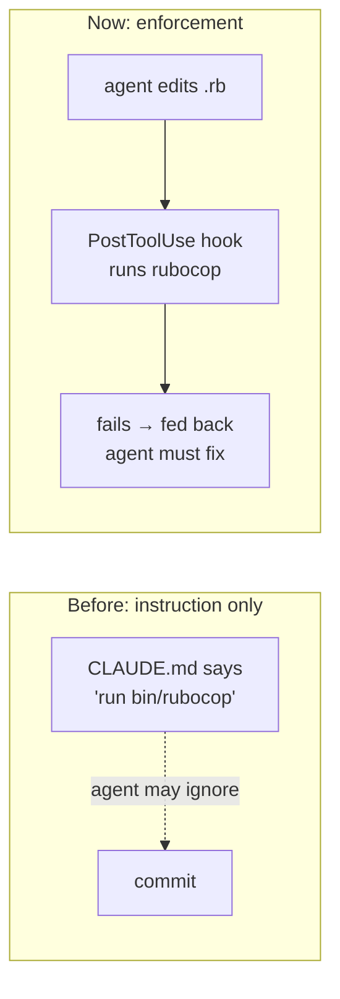
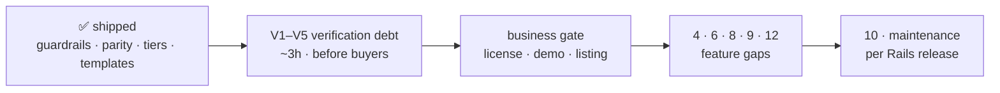

# Inventory, Gaps, and Low-Hanging Fruit

What a generated app actually contains, what it doesn't, and what's cheap to add next. Written as a working document for deciding what to build, not as marketing.

Status key: **✅ shipped** · **⚠️ partial** · **❌ absent**

---

## What a generated app looks like

---

## Inventory

### Agent alignment

| Item | Status | Notes |
|---|---|---|
| `CLAUDE.md` conventions | ✅ | Short-form rules, pattern budget, Slim pitfalls; detail lives in the two pattern docs. Stamped with the template commit it was generated from |
| Pattern reference docs | ✅ | `docs/rules/` — 55 single-rule files, 38 shipped in web mode and 40 in API mode. `INDEX.md` routes by path, `SYMPTOMS.md` by symptom or id |
| Workflow commands | ✅ | 24 commands, `/pick` → merge. One documented shape ([writing-commands](writing-commands.md)) and a stated invocation split (`WORKFLOW.md`, "Who invokes what"), both checked by `bin/lint-docs` |
| `WORKFLOW.md` spec | ✅ | Lifecycle diagrams, gates, sizing, contract slots |
| Doc canon | ✅ | 4 dirs, names load-bearing (commands read/write them). Terms defined once in `docs/system/vocabulary.md` |
| Doc index (`.llm/README.md`) | ✅ | Was referenced by 3 commands but missing — now shipped <!-- lint-docs:ignore -->|
| Task template | ✅ | Resumable task file format |
| `/workflow_setup` wizard | ✅ | Stack + CI tokens pre-filled; asks only repo/board/naming |
| Project `.claude/settings.json` | ✅ | Allowlist + deny rules; credentials blocked from context |
| Hooks | ✅ | RuboCop on Ruby edits, Slim bracket check, Draft-placeholder Stop hook |
| Subagent definitions | ❌ | No `.claude/agents/` — see gap 4 |
| Model-invocable conventions | ✅ | One skill, `.claude/skills/rails-conventions/`, pointing at `docs/rules/INDEX.md`. Closes the one cost [ADR 0001](../.agents/adr/0001-plain-markdown-commands-not-skills.md) accepted and could not mitigate: routing that only fires when something tells the agent to read the index first. Carries no rule content and no routing table ([ADR 0010](../.agents/adr/0010-skills-are-a-generated-overlay-over-the-rule-index.md)) |
| Cross-tool parity | ✅ | `AGENTS.md` + commands table, `.cursor/rules/conventions.mdc`, commands mirrored to `.cursor/commands/` |
| Template update path | ✅ | `bin/rocket-sheep-update` — three-way merges the alignment layer from the commit stamped in `CLAUDE.md`. Pull-only, `--check` mode, conflicts left as markers, ERB-rendered files reported not guessed ([ADR 0005](../.agents/adr/0005-updates-are-a-three-way-merge-from-the-stamp.md)) |
| Adoption into an existing app | ✅ | `adopt.rb` via `bin/rails app:template`. Alignment layer only — never `Gemfile`, `app/`, `config/`, `db/`. Same file defines the layer for generation and for updates, so there is one list ([ADR 0006](../.agents/adr/0006-adoption-installs-the-alignment-layer-only.md)) |
| Doc drift checks | ✅ | `bin/lint-docs` in this repo: rule frontmatter, index rows, token budgets, cross-mode links and `see_also`, `{{TOKEN}}` coverage, path resolution, command frontmatter and self-naming, router completeness, every count quoted in prose, and no routable IP or real ssh host in any doc. Not shipped into generated apps yet — see gap 9 |
| MCP config | ❌ | No `.mcp.json` |
| CI for this repo | ✅ | `.github/workflows/ci.yml`: the two doc gates plus `bin/smoke-generate`, which generates a real app in each mode and asserts the mode branched, the ERB rendered, and the app boots |

### Application

| Item | Status | Notes |
|---|---|---|
| Service objects | ✅ | `ApplicationService` + `Result` struct, log helpers |
| Form objects | ✅ | `ApplicationForm` — `ActiveModel`, `save`/`save!`, `promote_errors`. *Server-rendered mode; API mode gets `ApplicationContract` instead* |
| UI components | ✅ | ViewComponent + `ApplicationComponent`, four components with tests. *Server-rendered mode only* |
| Registry pattern | ✅ | `Data`-based, no base class — `PlanRegistry` is the canonical file |
| UUID primary keys | ⚠️ | PostgreSQL only, wired through the generators. MySQL apps get Rails' default bigint — MySQL has no native uuid type, and the rule file carries both halves |
| Soft deletes | ✅ | Discard installed, opt-in per table; `destroy` is the default |
| Audit trail | ✅ | PaperTrail `--with-changes` |
| Pagination | ✅ | Pagy, `Pagy::Method` included in `ApplicationController`. *Server-rendered mode; API mode paginates by cursor through `app/lib/cursor.rb`* |
| Query objects | ➖ | Documented pattern, no base class — `app/queries/` on first use |
| Policy objects | ➖ | Documented pattern, no base class — `app/policies/` on first use |
| Auth | ✅ | Devise (Turbo-configured) + Petergate |
| Frontend | ✅ | Slim, Tailwind, ViewComponent, 2 generic Stimulus controllers. *Server-rendered mode only — an API app ships no view layer and no asset pipeline* |
| SEO | ✅ | robots, sitemap, meta, canonical, JSON-LD, integration tests, Lighthouse CI. *Server-rendered mode only — an API serves no pages; the client repo owns it* |
| Fixture generator override | ✅ | Prevents the unique-index collision on first test run |
| Slow-test reporting | ✅ | Slowpoke, on by default, silent when the suite is clean |
| Billing | ❌ | Deliberate — see [comparison](comparison.md) |
| Teams / multi-tenancy | ❌ | Deliberate |
| Admin panel | ❌ | Deliberate |
| Component library | ❌ | Deliberate |
| API scaffolding | ✅ | `--api` generates the whole JSON boundary — see gap 13. The [out-of-scope ruling](../.agents/out-of-scope/api-scaffolding.md) that declined it was reversed on its own stated terms |
| Seeds / demo data | ✅ | Idempotent admin user, generated password, production-guarded |

### Infrastructure

| Item | Status | Notes |
|---|---|---|
| Database choice | ✅ | `--database=` is read, not re-asked: `postgresql`, `mysql`, `trilogy`, `mariadb-mysql`, `mariadb-trilogy`. `database.yml`, the Kamal accessory, the Dockerfile, and the primary-key convention all follow it; SQLite aborts before a file is written ([ADR 0007](../.agents/adr/0007-database-family-is-chosen-at-generation.md)) |
| Solid Stack | ✅ | Queue, Cache, Cable — separate databases, all environments |
| Kamal 2 | ✅ | Postgres accessory bound to localhost, entrypoint migrates |
| CI | ✅ | Rails 8 default: `scan_ruby`, `scan_js`, `lint`, `test`. API mode drops `scan_js` (no importmap) and adds `api-contract.yml`, which fails on `openapi.yaml` drift |
| Dependabot | ✅ | Rails 8 default |
| Lint / security | ✅ | RuboCop Omakase, Brakeman — clean on a fresh app |
| Job worker in deploy | ⚠️ | Documented in [deployment](deployment.md), not pre-configured — see gap 6 |
| Job dashboard | ❌ | Mission Control not wired up |
| Backups | ❌ | Documented as day-one work, no automation |
| Uptime monitoring | ❌ | Documented, not provided |
| PR / issue templates | ✅ | Tier-neutral PR template; issue forms encoding the ≤5-criteria sizing rule |
| CODEOWNERS | ❌ | Low value for a solo buyer |

---

## Gaps: shipped and remaining

The first wave targeted the weakness that mattered most: **the alignment layer was entirely advisory.** `CLAUDE.md` told an agent what to do; nothing stopped it doing otherwise. Hooks changed that.

### ✅ Shipped

**1. `.claude/settings.json` permission allowlist.** Covers the template's binstubs and read-only git/gh, so agents stop asking to run `bin/test`. Deny rules block reading `master.key`, `.kamal/secrets`, and `.env*` into context, and block `push --force` / `reset --hard` / `clean -fd`. Tracked in git as shared config; personal overrides go in the gitignored `settings.local.json`.

**2. Hooks.** `bin/hooks/post_edit` runs RuboCop on edited Ruby and catches Tailwind bracket classes in Slim shorthand — the pitfall `CLAUDE.md` documents but that otherwise fails at render time. `bin/hooks/session_end` reports `Status: Draft` doc placeholders left open. All three exit 0 on any internal error: a broken hook must never block work. See [Agent Guardrails](agent-guardrails.md).

**5. `AGENTS.md`.** Tool-neutral pointer to `CLAUDE.md` with an orientation table. Deliberately a pointer, not a second source — anything restated would drift. Its short list, `CLAUDE.md`'s, and the Cursor conventions file are all rendered per mode, because an API app told to use `ApplicationForm` and Slim is being told about an app it is not. `.cursorrules` still absent.

**7. Seeds.** `db/seeds.rb` creates an admin user, idempotent, password from `SEED_ADMIN_PASSWORD` or generated and printed once, and refuses to run in production without `SEED_ALLOW_PRODUCTION=1`.

**13. API mode.** `rails new --api` generates a JSON API with no view layer: seventeen rules for the boundary, the fifteen view-layer rules withheld, Doorkeeper and rack-cors added, base classes for `app/serializers`, `app/contracts` and `app/filters`, a `Cursor`, an RFC 9457 `problem` helper, an idempotency table, and `openapi.yaml` generated from the request tests with CI failing on drift. Mode is read from `config.api_only`, so both `template.rb` and `adopt.rb` pick the corpus without a flag. [ADR 0009](../.agents/adr/0009-api-mode-is-a-generation-flag.md).

### ✅ Shipped (continued)

**3. PR and issue templates.** `PULL_REQUEST_TEMPLATE.md` is tier-neutral: it explains in a comment when to add `Closes #` rather than hardcoding it, because tier `beads` must not have one. Carries the test plan and a checklist covering the suite, lint/scan, and the no-Draft-placeholder rule.

Issue forms (`feature.yml`, `bug.yml`) put the ≤5-acceptance-criteria rule and the size forecast at the point of creation. Blank issues stay enabled — a template that gets in the way gets bypassed, and then nothing is sized at all.

*Plan deviation:* the plan scoped issue templates to the `github-projects` tier. They apply to `labels` too, since that tier also uses GitHub Issues — only `beads` keeps issues outside GitHub. No gitignore change was needed either; `.github/` is tracked.

---

## Decided: tracker tiering

Settled by segue `.llm/threads/2026-08-06-tracker-abstraction.md` (merged). Full plan: `~/.claude/plans/composed-leaping-abelson.md`.

**Three tiers, resolved once by `/workflow_setup` into a `{{TRACKER}}` token:**

| Tier | For | State machine |
|---|---|---|
| `github-projects` | Today's buyer | Projects v2 board, `Closes #n` automation — unchanged |
| `beads` | GitHub Issues without a board | `bd` CLI, detected not shipped; real dependency semantics via `bd ready` |
| `labels` | No tracker at all | `status:*` labels; nothing hard-fails |

**Rejected, so they don't get re-tread:** Jira/Linear adapters (the interface is ~4 verbs, but the thread ID breaks entirely — `Closes #n` is GitHub-native and `prefix/n/slug` keys off a repo-local integer; Jira means smart-commits and a second convention set, not an adapter swap). Shipping `bd init` in `template.rb` — beads needs a running `dolt sql-server`, so the cost is CLI + second binary + daemon added to a product that today needs only Postgres.

**Coupling is three layers, not one:** forge ops (9 files calling `gh` — not worth abstracting, Jira shops still host code on GitHub), the Projects v2 board (5 files, ~4 verbs — the only real coupling), and issue-number-as-thread-ID (a convention, zero calls).

**Phases:**

1. **Agent-harness parity (~4h)** — ✅ done. Command prose neutralised, commands mirrored to `.cursor/commands/` from the same source files, `.cursor/rules/conventions.mdc` added, `AGENTS.md` gained a commands table so a harness with no slash-command concept can be told to follow a file directly.
2. **Tracker tiering (~1.5–2d)** — ✅ done. `/workflow_setup` resolves the tier first and fills `{{TRACKER}}`; `pick`, `feature_plan`, `task_plan`, `pr_submit`, and `implement` branch on the literal. Lazy reconciliation in `/pick` replaces the lost `Closes #n` automation under `beads`. `WORKFLOW.md` §2 and §4 are tier-aware; `docs/sop/beads-setup.md` covers the `dolt sql-server` requirement.
3. **Item 3 (~30m)** — ✅ done. Tier-neutral PR template, issue forms carrying the sizing rule.

**Load-bearing assumption, unmeasured:** that a minority of small Rails shops on GitHub use Projects v2 rather than plain Issues. This justifies the beads tier existing. If Projects v2 is near-universal among buyers, Phase 2 is over-built. The design doesn't collapse if it's wrong — it just costs more than it returns.

### Remaining

Nothing here blocks anything else. Ordered by what I'd do first.

#### Verification debt — do before buyers touch this

**V1. Walk the `github-projects` tier end-to-end on a live board.** *(~1h, needs a test org + Projects v2 board)*

This is the highest-priority item on the page. Tracker tiering refactored the code path that was previously the *only* path. It was verified by reading, not by running — no test board was available. Walk one issue through `/feature_plan` → `/task_plan` → `/implement` → `/pr_submit` → merge and confirm every board transition still fires and `Closes #n` still closes.

**V2. Walk the `beads` tier end-to-end.** *(~1h, needs `dolt sql-server` running)*

Individual `bd` commands were verified against a live DB. The *composition* was not: claim → set-state → PR merge → `/pick` reconciles it closed. Lazy reconciliation is a design that has never run.

**V3. Open one issue from the new forms after first push.** *(~5m)*

GitHub validates issue-form schema server-side only. A malformed form silently falls back to a blank issue rather than erroring, so local YAML validation doesn't prove it works.

~~**V5. Run a MySQL app's suite against a live server.**~~ **Discharged.** A server-rendered app was generated on MySQL 8.4, migrated, and run. All five unproven things came out right: Solid Queue built its thirteen tables, Cache its `solid_cache_entries`, Cable its `solid_cable_messages`; Devise's `index_users_on_email` is unique; PaperTrail's `object` and `object_changes` are `longtext` with `item_type` as `varchar(191)`, the index-length-safe form; and the fixture generator override held, so `rails g devise User` produced empty fixtures and the suite went green at 19 runs rather than raising on the unique index. No defects.

Neither database family carries this debt now. The PostgreSQL side was cleared by the [first-generation findings](first-generation-findings.md), which found nine defects, two of which had been silently affecting server-rendered apps; both families are now covered on every push by `bin/smoke-generate` in this repo's CI.

~~**V6. Run an API-mode app on MySQL.**~~ **Discharged.** Generated, bundled, migrated and exercised on MySQL 8.4: `resource_owner_id` came out `bigint` with the uuid patch correctly skipped, `idempotent_requests.user_id` followed the key type, the unique index and the `json` column built, eleven request tests passed, `api:contract` generated and its drift gate was clean. Cursor pagination was walked across three pages of rows sharing one `created_at` — the tiebreak case the rule warns about — with no row duplicated or skipped. No defects in the database half.

~~**V7. Adopt the layer into an app that already serves JSON.**~~ **Discharged, with a defect.** `bin/rails app:template` into a plain `rails new --api` app the template had never touched installed the 40-rule API corpus and the API router pair; the same run against a plain full-stack app installed the 38-rule web corpus. Mode detection works where the app wrote the setting.

It also surfaced the worst defect in this pass: `CLAUDE.md` and `AGENTS.md` were not mode-aware, so an API app — generated or adopted — got a Tech Stack line naming Hotwire, Tailwind, Slim, ViewComponent and Pagy, a convention list pointing at `ApplicationForm` and two rules that mode does not install, and a directory tree with `views/`, `forms/`, `components/` and `javascript/controllers/`. In the one file every agent loads first. Both are now templates that branch on the mode, and `adopt.rb` settles the mode above the first file that reads it.

~~**V8. Deploy an API-mode app with Kamal.**~~ **Partly discharged, and it was blocking.** No VPS here, so the deploy itself is still unrun — but the image build never needed one. The Dockerfile ran `bin/rails assets:precompile` unconditionally, and in an API app that task does not exist: `rails new --api` installs no asset pipeline, so `kamal deploy` of any generated API app failed at build. The asset steps and `asset_path` are now gated on the mode; `kamal init` and `.kamal/secrets` were verified clean in a full bundling run. What remains is a real deploy: the health-check surface and Thruster fronting an app with no static files.

**V4. Run the update path across a real gap, not a synthetic one.** *(~30m, needs an app generated a while ago)*

`bin/rocket-sheep-update` was verified against a two-commit range built for the purpose, and adoption against a `rails new --minimal` app: merge, conflict, add, upstream delete, rename, and the ERB hand-merge report all behave. What has not been exercised is the case it exists for — an app generated months ago, with real local edits, across a range containing rule renames and a command rewrite. Expect the failure mode to be conflict *volume*, not correctness, and if it clusters in one file that file is badly factored.

#### Feature gaps

**4. A `code-reviewer` subagent — ~2h.** `/rails_code_review` exists as a command, so the content is written. Packaging it as a `.claude/agents/` definition lets it run in its own context window rather than consuming the main one, and lets it be invoked automatically.

**12. An inbound triage command — ~4h, and only with buyer evidence.** `/pick`
surfaces prioritized ready work and assumes the board is already groomed. Nothing
grooms it: a new bug report, an external PR, or an issue with no acceptance
criteria sits there until a human categorises it by hand. The obstacle is not the
procedure but the vocabulary — triage states have to map onto all three tracker
tiers, and `/workflow_setup` owns that mapping. Wait until a buyer says their
board is the bottleneck.

**6. Job worker in `deploy.yml` — ~30m.** Solid Queue needs a worker. [Deployment](deployment.md) explains the `job:` role and the `SOLID_QUEUE_IN_PUMA` alternative but ships neither. A commented-out `job:` role turns a documentation step into an uncomment.

**8. `docs/qa/` and `docs/plans/` examples — ~30m.** Both ship empty. One worked QA guide and one design-doc template would make `/pr_qa` and `/feature_plan` output more consistent.

**9. Ship `bin/lint-docs` into generated apps — ~1h.** The generator now checks its
own docs against its own tree. A generated app carries the same corpus, the same
commands, and the same index, so it inherits the same drift risk with none of the
checking. The obstacle is scope, not difficulty: the checks that read
`templates/` need a path shim, and the count checks need to run against the app's
own docs. It would also give `/update_docs` something deterministic to end with.

**14. `.cursor/commands/` drift guard — ~20m.** The two command directories are mirrored at generation time and `/workflow_setup` fills both, but nothing stops them diverging afterwards. A CI step running `diff -r .claude/commands .cursor/commands` would catch it. Low urgency, near-zero cost.

#### Maintenance, ongoing

**10. Re-verify against each Rails release.** The template patches specific Rails files by matching their content (`config/application.rb`, `config/environments/development.rb`, the layout). A Rails release can break *generation* — already-generated apps are unaffected. Nobody is scheduled to do this, and it's how the product quietly dies.

Last verified 2026-08-06 against **Ruby 4.0.6 / Rails 8.1.3.1**: all anchors still match, generated app is green on `bin/test`, `bin/rubocop`, `bin/brakeman`. Rails 9 is the next exposure.

#### Unmeasured assumption

**11. Projects v2 adoption among small Rails shops.** The `beads` tier exists because a minority were assumed to use Projects v2 rather than plain Issues. Never measured. If Projects v2 turns out near-universal among buyers, Phase 2 was over-built — the design doesn't collapse, it just cost more than it returned. Cheapest resolution is asking the first ten buyers.

---

## Known weak points

Not gaps to fill — things to be honest about.

**Jira and Linear buyers still aren't served.** The three tiers cover GitHub Projects, GitHub Issues via beads, and no tracker at all — but a shop whose issues live in Jira gets the fourteen tracker-independent commands and nothing else. That was a deliberate call (the thread ID doesn't survive the move; see [workflow](workflow.md)), but the sales page must say so rather than letting buyers discover it.

**24 commands is a lot to learn.** The chain is self-navigating, which mitigates it, but the first-run experience is a directory of 24 unfamiliar files. A single "start here" path — `/workflow_setup` then `/pick` — is documented but easy to miss.

**Template generation is version-coupled.** The template patches specific Rails files by matching their content. Rails 8.1 or 9 could break generation. Already-generated apps are unaffected, but the product needs re-verification against each Rails release, and that's ongoing maintenance nobody is scheduled to do.

**Two modes means one rule can have two halves too.** Eight rules ship to both a server-rendered and an API app and state both flavours, the way the database rules state two databases. An agent that reads the wrong half writes a redirect into a JSON endpoint — quieter than a mismatched foreign key, since nothing raises. The mitigations are that `modes` withholds the fifteen rules that would be pure noise, and that the two corpora have separate routing indexes so a path row never names a rule the app does not have. Stated in [ADR 0009](../.agents/adr/0009-api-mode-is-a-generation-flag.md).

**Two databases means one convention has two halves.** `docs/rules/database-conventions.md` and `safe-migrations.md` now route off the Tech Stack line in `CLAUDE.md` rather than stating one rule. An agent that reads the wrong half writes a foreign key that will not match — loudly, at migration time, which is the mitigation. The alternative was making those files ERB, which would have cost them their three-way update path. Stated in [ADR 0007](../.agents/adr/0007-database-family-is-chosen-at-generation.md).

**An adopting app carries rules for patterns it doesn't have.** Adoption installs the rule corpus and none of the application code, so `ApplicationService`, `ApplicationForm`, the registries, Slim and ViewComponent are documented in an app that may use none of them. The instruction is to rewrite or delete per rule on the first pass, and the closing output says so — but nothing checks that anyone did, and a rule pointing at a class that does not exist is a rule an agent will believe. This is the accepted cost in [ADR 0006](../.agents/adr/0006-adoption-installs-the-alignment-layer-only.md), and the most likely source of a bad first impression for an adopting buyer.

**Conventions drift under pressure.** An agent deep in a long debugging session violates `CLAUDE.md` occasionally. This reduces divergence; it doesn't eliminate it. Gap 2 is the only real answer.

---

## Suggested order

Every gap from the original ranking is closed. What's left splits three ways:

1. **Verification debt (V1–V5, ~3h)** — the `github-projects` regression risk is the single highest-priority item here. It was the only path before tiering refactored it. V4 waits on an app old enough to be worth updating.
2. **Business gate** — nothing engineering-side blocks selling; the LICENSE placeholders, deployed demo, and storefront do. Those live in `../../monetization-assessment.md`, outside this repo.
3. **Feature gaps (4, 6, 8, 9, 12)** — worth doing, but they can wait for buyer feedback, which is the point at which guessing stops and evidence starts.
