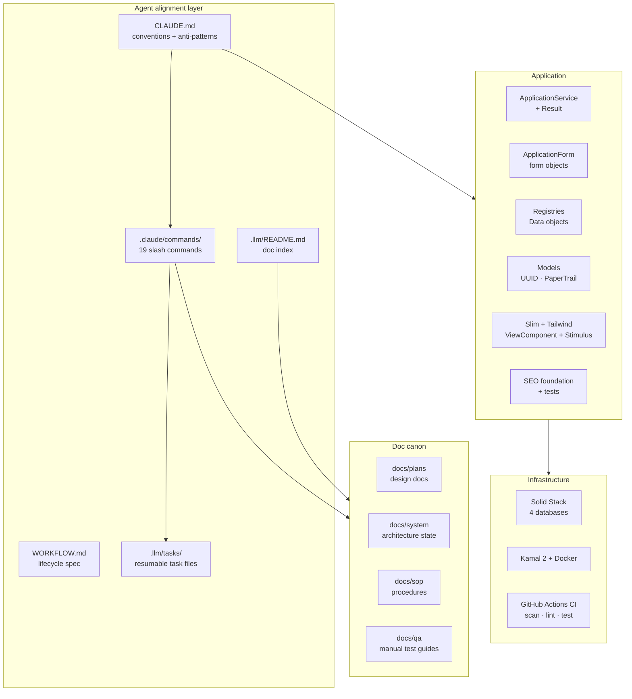
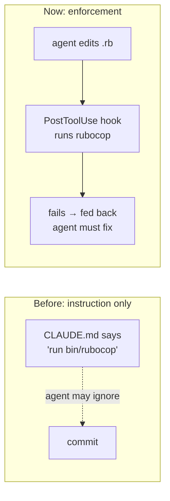
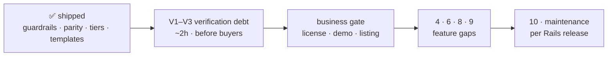

# Inventory, Gaps, and Low-Hanging Fruit

What a generated app actually contains, what it doesn't, and what's cheap to add next. Written as a working document for deciding what to build, not as marketing.

Status key: **✅ shipped** · **⚠️ partial** · **❌ absent**

---

## What a generated app looks like

---

## Inventory

### Agent alignment

| Item | Status | Notes |
|---|---|---|
| `CLAUDE.md` conventions | ✅ | Short-form rules, pattern budget, Slim pitfalls; detail lives in the two pattern docs |
| Pattern reference docs | ✅ | `docs/rules/` — 37 single-rule files + `INDEX.md` routing by path, symptom, or id. Backend, views, and tests |
| Workflow commands | ✅ | 19 commands, `/pick` → merge |
| `WORKFLOW.md` spec | ✅ | Lifecycle diagrams, gates, sizing, contract slots |
| Doc canon | ✅ | 4 dirs, names load-bearing (commands read/write them) |
| Doc index (`.llm/README.md`) | ✅ | Was referenced by 3 commands but missing — now shipped |
| Task template | ✅ | Resumable task file format |
| `/workflow_setup` wizard | ✅ | Stack + CI tokens pre-filled; asks only repo/board/naming |
| Project `.claude/settings.json` | ✅ | Allowlist + deny rules; credentials blocked from context |
| Hooks | ✅ | RuboCop on Ruby edits, Slim bracket check, Draft-placeholder Stop hook |
| Subagent definitions | ❌ | No `.claude/agents/` — see gap 4 |
| Cross-tool parity | ✅ | `AGENTS.md` + commands table, `.cursor/rules/conventions.mdc`, commands mirrored to `.cursor/commands/` |
| MCP config | ❌ | No `.mcp.json` |

### Application

| Item | Status | Notes |
|---|---|---|
| Service objects | ✅ | `ApplicationService` + `Result` struct, log helpers |
| Form objects | ✅ | `ApplicationForm` — `ActiveModel`, `save`/`save!`, `promote_errors` |
| UI components | ✅ | ViewComponent + `ApplicationComponent`, four components with tests |
| Registry pattern | ✅ | `Data`-based, no base class — `PlanRegistry` is the canonical file |
| UUID primary keys | ✅ | Wired through generators |
| Soft deletes | ✅ | Discard installed, opt-in per table; `destroy` is the default |
| Audit trail | ✅ | PaperTrail `--with-changes` |
| Pagination | ✅ | Pagy, included in `ApplicationController` and `ApplicationHelper` |
| Query objects | ➖ | Documented pattern, no base class — `app/queries/` on first use |
| Policy objects | ➖ | Documented pattern, no base class — `app/policies/` on first use |
| Auth | ✅ | Devise (Turbo-configured) + Petergate |
| Frontend | ✅ | Slim, Tailwind, ViewComponent, 2 generic Stimulus controllers |
| SEO | ✅ | robots, sitemap, meta, canonical, JSON-LD, integration tests, Lighthouse CI |
| Fixture generator override | ✅ | Prevents the unique-index collision on first test run |
| Slow-test reporting | ✅ | Slowpoke, on by default, silent when the suite is clean |
| Billing | ❌ | Deliberate — see [comparison](comparison.md) |
| Teams / multi-tenancy | ❌ | Deliberate |
| Admin panel | ❌ | Deliberate |
| Component library | ❌ | Deliberate |
| API scaffolding | ❌ | Deliberate |
| Seeds / demo data | ✅ | Idempotent admin user, generated password, production-guarded |

### Infrastructure

| Item | Status | Notes |
|---|---|---|
| Solid Stack | ✅ | Queue, Cache, Cable — separate databases, all environments |
| Kamal 2 | ✅ | Postgres accessory bound to localhost, entrypoint migrates |
| CI | ✅ | Rails 8 default: `scan_ruby`, `scan_js`, `lint`, `test` |
| Dependabot | ✅ | Rails 8 default |
| Lint / security | ✅ | RuboCop Omakase, Brakeman — clean on a fresh app |
| Job worker in deploy | ⚠️ | Documented in [deployment](deployment.md), not pre-configured — see gap 6 |
| Job dashboard | ❌ | Mission Control not wired up |
| Backups | ❌ | Documented as day-one work, no automation |
| Uptime monitoring | ❌ | Documented, not provided |
| PR / issue templates | ✅ | Tier-neutral PR template; issue forms encoding the ≤5-criteria sizing rule |
| CODEOWNERS | ❌ | Low value for a solo buyer |

---

## Gaps: shipped and remaining

The first wave targeted the weakness that mattered most: **the alignment layer was entirely advisory.** `CLAUDE.md` told an agent what to do; nothing stopped it doing otherwise. Hooks changed that.

### ✅ Shipped

**1. `.claude/settings.json` permission allowlist.** Covers the template's binstubs and read-only git/gh, so agents stop asking to run `bin/test`. Deny rules block reading `master.key`, `.kamal/secrets`, and `.env*` into context, and block `push --force` / `reset --hard` / `clean -fd`. Tracked in git as shared config; personal overrides go in the gitignored `settings.local.json`.

**2. Hooks.** `bin/hooks/post_edit` runs RuboCop on edited Ruby and catches Tailwind bracket classes in Slim shorthand — the pitfall `CLAUDE.md` documents but that otherwise fails at render time. `bin/hooks/session_end` reports `Status: Draft` doc placeholders left open. All three exit 0 on any internal error: a broken hook must never block work. See [Agent Guardrails](agent-guardrails.md).

**5. `AGENTS.md`.** Tool-neutral pointer to `CLAUDE.md` with an orientation table. Deliberately a pointer, not a second source — anything restated would drift. `.cursorrules` still absent.

**7. Seeds.** `db/seeds.rb` creates an admin user, idempotent, password from `SEED_ADMIN_PASSWORD` or generated and printed once, and refuses to run in production without `SEED_ALLOW_PRODUCTION=1`.

### ✅ Shipped (continued)

**3. PR and issue templates.** `PULL_REQUEST_TEMPLATE.md` is tier-neutral: it explains in a comment when to add `Closes #` rather than hardcoding it, because tier `beads` must not have one. Carries the test plan and a checklist covering the suite, lint/scan, and the no-Draft-placeholder rule.

Issue forms (`feature.yml`, `bug.yml`) put the ≤5-acceptance-criteria rule and the size forecast at the point of creation. Blank issues stay enabled — a template that gets in the way gets bypassed, and then nothing is sized at all.

*Plan deviation:* the plan scoped issue templates to the `github-projects` tier. They apply to `labels` too, since that tier also uses GitHub Issues — only `beads` keeps issues outside GitHub. No gitignore change was needed either; `.github/` is tracked.

---

## Decided: tracker tiering

Settled by segue `.llm/threads/2026-08-06-tracker-abstraction.md` (merged). Full plan: `~/.claude/plans/composed-leaping-abelson.md`.

**Three tiers, resolved once by `/workflow_setup` into a `{{TRACKER}}` token:**

| Tier | For | State machine |
|---|---|---|
| `github-projects` | Today's buyer | Projects v2 board, `Closes #n` automation — unchanged |
| `beads` | GitHub Issues without a board | `bd` CLI, detected not shipped; real dependency semantics via `bd ready` |
| `labels` | No tracker at all | `status:*` labels; nothing hard-fails |

**Rejected, so they don't get re-tread:** Jira/Linear adapters (the interface is ~4 verbs, but the thread ID breaks entirely — `Closes #n` is GitHub-native and `prefix/n/slug` keys off a repo-local integer; Jira means smart-commits and a second convention set, not an adapter swap). Shipping `bd init` in `template.rb` — beads needs a running `dolt sql-server`, so the cost is CLI + second binary + daemon added to a product that today needs only Postgres.

**Coupling is three layers, not one:** forge ops (9 files calling `gh` — not worth abstracting, Jira shops still host code on GitHub), the Projects v2 board (5 files, ~4 verbs — the only real coupling), and issue-number-as-thread-ID (a convention, zero calls).

**Phases:**

1. **Agent-harness parity (~4h)** — ✅ done. Command prose neutralised, commands mirrored to `.cursor/commands/` from the same source files, `.cursor/rules/conventions.mdc` added, `AGENTS.md` gained a commands table so a harness with no slash-command concept can be told to follow a file directly.
2. **Tracker tiering (~1.5–2d)** — ✅ done. `/workflow_setup` resolves the tier first and fills `{{TRACKER}}`; `pick`, `feature_plan`, `task_plan`, `pr_submit`, and `implement` branch on the literal. Lazy reconciliation in `/pick` replaces the lost `Closes #n` automation under `beads`. `WORKFLOW.md` §2 and §4 are tier-aware; `docs/sop/beads-setup.md` covers the `dolt sql-server` requirement.
3. **Item 3 (~30m)** — ✅ done. Tier-neutral PR template, issue forms carrying the sizing rule.

**Load-bearing assumption, unmeasured:** that a minority of small Rails shops on GitHub use Projects v2 rather than plain Issues. This justifies the beads tier existing. If Projects v2 is near-universal among buyers, Phase 2 is over-built. The design doesn't collapse if it's wrong — it just costs more than it returns.

### Remaining

Nothing here blocks anything else. Ordered by what I'd do first.

#### Verification debt — do before buyers touch this

**V1. Walk the `github-projects` tier end-to-end on a live board.** *(~1h, needs a test org + Projects v2 board)*

This is the highest-priority item on the page. Tracker tiering refactored the code path that was previously the *only* path. It was verified by reading, not by running — no test board was available. Walk one issue through `/feature_plan` → `/task_plan` → `/implement` → `/pr_submit` → merge and confirm every board transition still fires and `Closes #n` still closes.

**V2. Walk the `beads` tier end-to-end.** *(~1h, needs `dolt sql-server` running)*

Individual `bd` commands were verified against a live DB. The *composition* was not: claim → set-state → PR merge → `/pick` reconciles it closed. Lazy reconciliation is a design that has never run.

**V3. Open one issue from the new forms after first push.** *(~5m)*

GitHub validates issue-form schema server-side only. A malformed form silently falls back to a blank issue rather than erroring, so local YAML validation doesn't prove it works.

#### Feature gaps

**4. A `code-reviewer` subagent — ~2h.** `/rails_code_review` exists as a command, so the content is written. Packaging it as a `.claude/agents/` definition lets it run in its own context window rather than consuming the main one, and lets it be invoked automatically.

**6. Job worker in `deploy.yml` — ~30m.** Solid Queue needs a worker. [Deployment](deployment.md) explains the `job:` role and the `SOLID_QUEUE_IN_PUMA` alternative but ships neither. A commented-out `job:` role turns a documentation step into an uncomment.

**8. `docs/qa/` and `docs/plans/` examples — ~30m.** Both ship empty. One worked QA guide and one design-doc template would make `/pr_qa` and `/feature_plan` output more consistent.

**9. `.cursor/commands/` drift guard — ~20m.** The two command directories are mirrored at generation time and `/workflow_setup` fills both, but nothing stops them diverging afterwards. A CI step running `diff -r .claude/commands .cursor/commands` would catch it. Low urgency, near-zero cost.

#### Maintenance, ongoing

**10. Re-verify against each Rails release.** The template patches specific Rails files by matching their content (`config/application.rb`, `config/environments/development.rb`, the layout). Rails 8.1 or 9 can break *generation* — already-generated apps are unaffected. Nobody is scheduled to do this, and it's how the product quietly dies.

#### Unmeasured assumption

**11. Projects v2 adoption among small Rails shops.** The `beads` tier exists because a minority were assumed to use Projects v2 rather than plain Issues. Never measured. If Projects v2 turns out near-universal among buyers, Phase 2 was over-built — the design doesn't collapse, it just cost more than it returned. Cheapest resolution is asking the first ten buyers.

---

## Known weak points

Not gaps to fill — things to be honest about.

**Jira and Linear buyers still aren't served.** The three tiers cover GitHub Projects, GitHub Issues via beads, and no tracker at all — but a shop whose issues live in Jira gets the ten tracker-independent commands and nothing else. That was a deliberate call (the thread ID doesn't survive the move; see [workflow](workflow.md)), but the sales page must say so rather than letting buyers discover it.

**19 commands is a lot to learn.** The chain is self-navigating, which mitigates it, but the first-run experience is a directory of 19 unfamiliar files. A single "start here" path — `/workflow_setup` then `/pick` — is documented but easy to miss.

**Template generation is version-coupled.** The template patches specific Rails files by matching their content. Rails 8.1 or 9 could break generation. Already-generated apps are unaffected, but the product needs re-verification against each Rails release, and that's ongoing maintenance nobody is scheduled to do.

**Conventions drift under pressure.** An agent deep in a long debugging session violates `CLAUDE.md` occasionally. This reduces divergence; it doesn't eliminate it. Gap 2 is the only real answer.

---

## Suggested order

Every gap from the original ranking is closed. What's left splits three ways:

1. **Verification debt (V1–V3, ~2h)** — the `github-projects` regression risk is the single highest-priority item here. It was the only path before tiering refactored it.
2. **Business gate** — nothing engineering-side blocks selling; the LICENSE placeholders, deployed demo, and storefront do. Those live in `../../monetization-assessment.md`, outside this repo.
3. **Feature gaps (4, 6, 8, 9)** — worth doing, but they can wait for buyer feedback, which is the point at which guessing stops and evidence starts.
