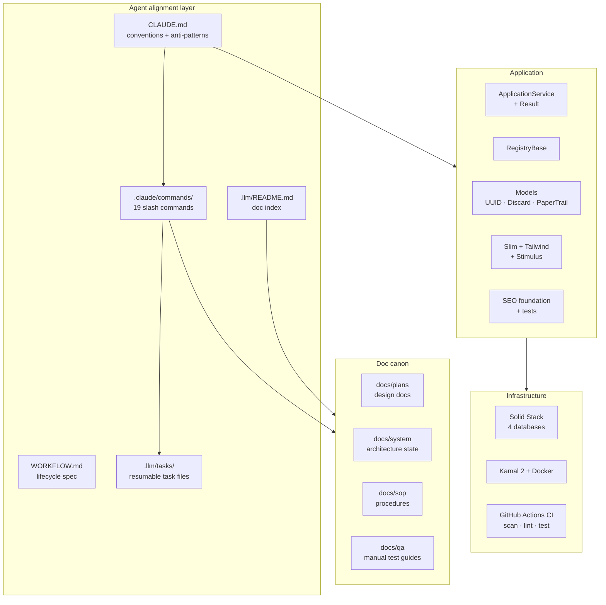
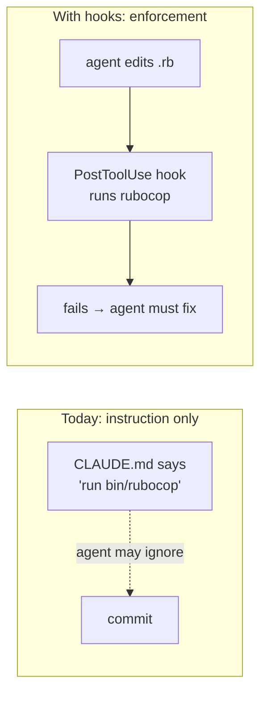
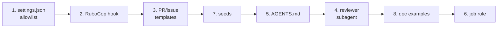

# Inventory, Gaps, and Low-Hanging Fruit

What a generated app actually contains, what it doesn't, and what's cheap to add next. Written as a working document for deciding what to build, not as marketing.

Status key: **✅ shipped** · **⚠️ partial** · **❌ absent**

---

## What a generated app looks like

---

## Inventory

### Agent alignment

| Item | Status | Notes |
|---|---|---|
| `CLAUDE.md` conventions | ✅ | Style, patterns, anti-patterns with before/after pairs, Slim pitfalls |
| Workflow commands | ✅ | 19 commands, `/pick` → merge |
| `WORKFLOW.md` spec | ✅ | Lifecycle diagrams, gates, sizing, contract slots |
| Doc canon | ✅ | 4 dirs, names load-bearing (commands read/write them) |
| Doc index (`.llm/README.md`) | ✅ | Was referenced by 3 commands but missing — now shipped |
| Task template | ✅ | Resumable task file format |
| `/workflow_setup` wizard | ✅ | Stack + CI tokens pre-filled; asks only repo/board/naming |
| Project `.claude/settings.json` | ❌ | No permission allowlist — see gap 1 |
| Hooks | ❌ | No enforcement, only instruction — see gap 2 |
| Subagent definitions | ❌ | No `.claude/agents/` — see gap 4 |
| Cross-tool parity | ❌ | No `AGENTS.md` / `.cursorrules` — see gap 5 |
| MCP config | ❌ | No `.mcp.json` |

### Application

| Item | Status | Notes |
|---|---|---|
| Service objects | ✅ | `ApplicationService` + `Result` struct, log helpers |
| Registry pattern | ✅ | `RegistryBase` + working `AppConfig` reference |
| UUID primary keys | ✅ | Wired through generators |
| Soft deletes | ✅ | Discard |
| Audit trail | ✅ | PaperTrail `--with-changes` |
| Pagination | ✅ | Pagy |
| Auth | ✅ | Devise (Turbo-configured) + Petergate |
| Frontend | ✅ | Slim, Tailwind, 2 generic Stimulus controllers |
| SEO | ✅ | robots, sitemap, meta, canonical, JSON-LD, integration tests, Lighthouse CI |
| Fixture generator override | ✅ | Prevents the unique-index collision on first test run |
| Billing | ❌ | Deliberate — see [comparison](comparison.md) |
| Teams / multi-tenancy | ❌ | Deliberate |
| Admin panel | ❌ | Deliberate |
| Component library | ❌ | Deliberate |
| API scaffolding | ❌ | Deliberate |
| Seeds / demo data | ❌ | See gap 7 |

### Infrastructure

| Item | Status | Notes |
|---|---|---|
| Solid Stack | ✅ | Queue, Cache, Cable — separate databases, all environments |
| Kamal 2 | ✅ | Postgres accessory bound to localhost, entrypoint migrates |
| CI | ✅ | Rails 8 default: `scan_ruby`, `scan_js`, `lint`, `test` |
| Dependabot | ✅ | Rails 8 default |
| Lint / security | ✅ | RuboCop Omakase, Brakeman — clean on a fresh app |
| Job worker in deploy | ⚠️ | Documented in [deployment](deployment.md), not pre-configured — see gap 6 |
| Job dashboard | ❌ | Mission Control not wired up |
| Backups | ❌ | Documented as day-one work, no automation |
| Uptime monitoring | ❌ | Documented, not provided |
| PR / issue templates | ❌ | See gap 3 |
| CODEOWNERS | ❌ | Low value for a solo buyer |

---

## Gaps worth closing, ranked

Ranked by leverage per hour of work. The first two are the highest-value items on this list and both target the same weakness: **the alignment layer is entirely advisory.** `CLAUDE.md` tells an agent what to do; nothing stops it doing otherwise.

### 1. Project `.claude/settings.json` with a permission allowlist — ~1 hour

Every generated app makes an agent ask permission for `bin/test`, `bin/rubocop`, `bin/rails`, `git status`, `git diff`. Dozens of prompts per session, all for read-only or obviously safe commands.

Ship a project-level allowlist covering the template's own binstubs and read-only git, plus a `deny` list for genuinely dangerous operations. Highest ratio of annoyance removed to effort on the list, and it's a visible quality signal the first time a buyer runs the app.

### 2. Hooks for enforcement — ~3 hours

The conventions are advisory. Hooks make some of them mechanical:

- **PostToolUse** on Ruby edits → run `bin/rubocop` on the touched file, fail loudly
- **PostToolUse** on `.slim` edits → catch the Tailwind bracket pitfall the docs warn about
- **PreToolUse** on `git commit` → block if the suite hasn't run
- **Stop** → warn when a `Status: Draft` doc placeholder is still present

This is the strongest available answer to "keep the agent in line", and it's the thing no competing template offers. Worth doing before most feature work.

Caveat: hooks that fire too often become noise the user disables. Start with the RuboCop one only.

### 3. PR and issue templates — ~30 min

The workflow depends on `Closes #N` in every PR body. `/pr_submit` writes it, but a human opening a PR by hand won't. A `PULL_REQUEST_TEMPLATE.md` carrying the `Closes #` line and the test-plan checklist makes the convention survive contact with humans. Issue templates can encode the ≤5-acceptance-criteria sizing rule at the point of creation, which is where sizing actually gets decided.

### 4. A `code-reviewer` subagent — ~2 hours

`/rails_code_review` exists as a command, so the content is written. Packaging it as a `.claude/agents/` definition lets it run in its own context window instead of consuming the main one, and lets it be invoked automatically rather than only by hand.

### 5. `AGENTS.md` cross-tool parity — ~15 min

`AGENTS.md` is becoming the tool-neutral convention file. A symlink or short pointer file means Cursor, Codex, and others pick up the same conventions. Cheapest item here; matters mainly for buyers not using Claude Code, which the FAQ currently answers with "symlink it yourself".

### 6. Job worker in `deploy.yml` — ~30 min

Solid Queue needs a worker. [Deployment](deployment.md) explains the `job:` role and the `SOLID_QUEUE_IN_PUMA` alternative, but ships neither. A commented-out `job:` role in `config/deploy.yml` turns a documentation step into an uncomment.

### 7. Seeds / demo data — ~1 hour

`db/seeds.rb` is empty. A generated app has no user to log in as, so the first thing every buyer does is create one by hand in the console. A seed creating an admin user (credentials printed, not hardcoded to anything guessable) removes that.

### 8. `docs/qa/` example — ~30 min

The directory ships empty and `/pr_qa` writes into it, but there's no example of the expected shape. One worked QA guide makes the format obvious. Same argument applies to `docs/plans/`, where a design-doc template would make `/feature_plan` output more consistent.

---

## Known weak points

Not gaps to fill — things to be honest about.

**The workflow assumes GitHub Projects.** `/pick`, `/feature_plan`, and `/task_plan` lose most of their value without a board. Buyers using Linear, Jira, or nothing get roughly half the value, and nothing in the product currently tells them that before purchase. The [workflow doc](workflow.md) says it; the sales page must too.

**19 commands is a lot to learn.** The chain is self-navigating, which mitigates it, but the first-run experience is a directory of 19 unfamiliar files. A single "start here" path — `/workflow_setup` then `/pick` — is documented but easy to miss.

**Template generation is version-coupled.** The template patches specific Rails files by matching their content. Rails 8.1 or 9 could break generation. Already-generated apps are unaffected, but the product needs re-verification against each Rails release, and that's ongoing maintenance nobody is scheduled to do.

**Conventions drift under pressure.** An agent deep in a long debugging session violates `CLAUDE.md` occasionally. This reduces divergence; it doesn't eliminate it. Gap 2 is the only real answer.

---

## Suggested order

Items 1, 2, 3, 5, and 7 total roughly a day and a half and close every cheap gap. Items 4, 6, and 8 are worth doing but can wait for buyer feedback — which is the point at which guessing stops and evidence starts.
