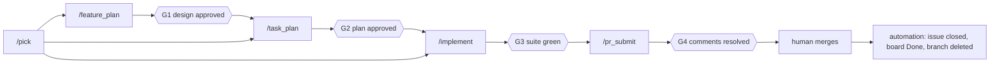
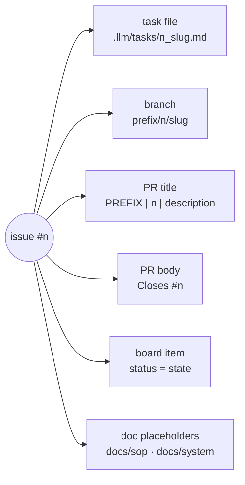

# The Agent Workflow

Every generated app ships with 19 slash commands that drive work from "what should I do next" through to a merged PR. This is the piece that turns the conventions in `CLAUDE.md` from advice into a process.

Full spec, diagrams, and gate definitions live in the generated app's `WORKFLOW.md`. This page is the orientation.

---

## The chain

```
/pick (entry, routes by state) → /feature_plan → /task_plan → /implement → /pr_submit → human merge → automation
```

Every command ends by naming the next one, so the workflow self-navigates. `/pick` is the entry door for every session — it surfaces prioritized ready work and routes each item by shape and board state.



## Why a workflow at all

The conventions layer stops an agent writing *inconsistent* code. It does nothing about the other failure modes:

- **Unbounded scope.** An agent handed "add billing" will happily produce a 2,000-line PR nobody can review.
- **Lost state between sessions.** Close the laptop mid-feature and the next session starts from nothing.
- **Work that skips review.** Code that never had a plan approved, or shipped with a stale doc placeholder.

The workflow fixes those with three mechanisms: **gates**, **the thread ID**, and **sizing rules**.

---

## Gates

Four checkpoints. Two human approvals, one automated check, one review.

| # | Gate | Where | Kind | Blocks |
|---|---|---|---|---|
| G1 | Design doc approved | `/feature_plan` | Human | Issue creation — issues are commitment, the doc is a proposal |
| G2 | Implementation plan approved | `/task_plan` | Human | Any code |
| G3 | Local suite green | `/pr_submit` | Automated | Push / PR creation |
| G4 | Review comments resolved | `/pr_submit` | Human | Merge |

Gates are prompt-enforced by default. Branch protection with required CI checks turns G3 and G4 into hard gates that GitHub enforces rather than the agent.

The design of G1 is the non-obvious one: the agent may not create issues until you've approved the design. Issues are a commitment; a design doc is a proposal you can throw away cheaply.

---

## The thread ID

One issue number connects every artifact. This is what lets any command reconstruct state from scratch — any session, any machine, no handoff notes.



Practical effect: `/implement` is idempotent. Run it in a fresh session with no memory of the previous one and it reloads the task file, orients itself, and continues. State lives in GitHub and in the task file — never in a conversation.

---

## Sizing

Grounded in analysis of 100 merged PRs: under 300 added lines merged in a median of one day; 600+ took three.

| Size | Added lines | Guidance |
|---|---|---|
| XS | <100 | Fine; consider batching with related work |
| S | 100–300 | Ideal — merges in ~1 day |
| M | 300–600 | Healthy upper bound |
| L | 600–1,200 | Split if possible; expect ~3-day review |
| XL | 1,200+ | Must split |

An issue fits when its acceptance criteria fit in ≤5 testable bullets. More than that is an epic — decompose it.

**Scope-escape rule:** if a forecast passes 600 added lines mid-implementation, or new acceptance criteria appear, stop. Split a sub-issue and land the current slice clean. This is the rule that prevents the runaway PR.

---

## Segues

`/segue` is the escape valve. Mid-planning or mid-implementation you hit a question that deserves real thought but would derail the current thread — a library choice, a data-model concern, an unexpected constraint.

```
/segue        open an isolated thread
/segue_close  write findings and the path forward
/segue_merge  merge findings back into the workstream
/segue_resume pick up an open thread in a fresh session
/segue_kill   abandon a dead end, recording why it died
```

Only the *findings* merge back — not the exploration. The workstream stays clean, and the reasoning is preserved rather than lost in scrollback.

---

## Command inventory

| Command | Tier | Job |
|---|---|---|
| `/pick` | Core | Entry door. Prioritized ready work; routes epic → `/feature_plan`, sized Todo → `/task_plan`, In Progress → `/implement`, Blocked → show blocker |
| `/feature_plan` | Core | Explore → design doc (G1) → sized sub-issues + doc placeholders → board Todo |
| `/task_plan` | Core | Read design doc → task file + plan (G2) → branch → In Progress |
| `/implement` | Core | Idempotent resume: load task file, orient, execute, commit per logical unit |
| `/pr_submit` | Core | Suite (G3) → docs complete-or-delete → PR with `Closes #n` → stack footer → comments (G4) |
| `/pr_review` | Core | Reviewer side: full-context diff review |
| `/pr_qa` | Core | Guided manual QA pass, structured report |
| `/update_docs` | Core | On-demand deep doc pass; keeps the index honest |
| `/rails_code_review` | Core | Rails-specific review against this stack's conventions |
| `/segue` ×5 | Optional | Isolated discussion threads with findings-only merge-back |
| `/pr_comment_resolver` | Optional | Work through review comments |
| `/pr_fix_ci` | Optional | Diagnose and fix a failing CI run |
| `/test_fix` | Optional | Fix failing tests |
| `/run_lint` | Optional | Lint and auto-fix |
| `/workflow_setup` | Setup | One-time wizard: repo, board, naming, CI checks |

---

## Setup

The commands arrive with stack tokens already filled — test, lint, and security-scan commands, and the default branch, are known because this template *is* the stack. What remains is repo-specific.

```
/workflow_setup
```

The wizard collects your GitHub org and repo, creates or connects a Projects board, resolves the board's field and option IDs, asks for branch and PR naming conventions, confirms the pre-filled tool commands, and verifies repo automation settings.

Restart your Claude session afterwards, then run `/pick`.

### Requirements

- A GitHub repo with a remote (the wizard stops without one)
- GitHub Projects (v2) board with statuses: Todo, In Progress, Up for Review, Done, Blocked
- `gh` CLI authenticated. Board operations need `gh auth refresh -s project`

### Repo automation

Three settings do the post-merge work, so no command has to:

1. **"Automatically delete head branches"** — enabled on the repo
2. **Board workflow "item closed → status Done"** — enabled on the project
3. **`Closes #N` in every PR body** — `/pr_submit` writes this automatically

With those on, merging is a single human click and everything downstream is automatic.

---

## Contract slots

Exactly one owner per slot. This matters if you run other agent tooling alongside — memory systems, indexers, background agents. Anything claiming authority over a slot below will fight the workflow, so silence its competing instructions or don't run it.

| Slot | Owner |
|---|---|
| State machine | GitHub issues + Projects board |
| Resumability artifact | Task files in `.llm/tasks/` (local, gitignored) |
| Memory home | `CLAUDE.md` + the `docs/` canon |

---

## Using only part of it

The commands are markdown files. Delete what you don't want.

The core chain assumes GitHub Issues and a Projects board. Without a board, `/pick`, `/feature_plan`, and `/task_plan` lose most of their value — but `/pr_submit`, `/pr_review`, `/rails_code_review`, `/pr_qa`, and the segue set all work standalone on any repo with `gh` access.

If you don't use GitHub at all, delete `.claude/commands/` entirely. The rest of the template is unaffected.
