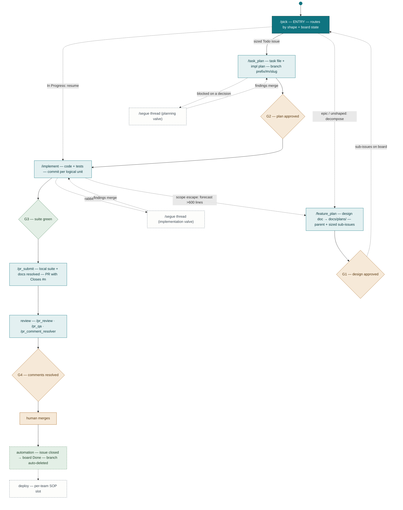
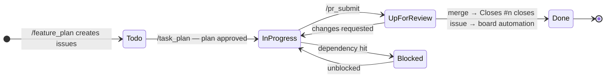
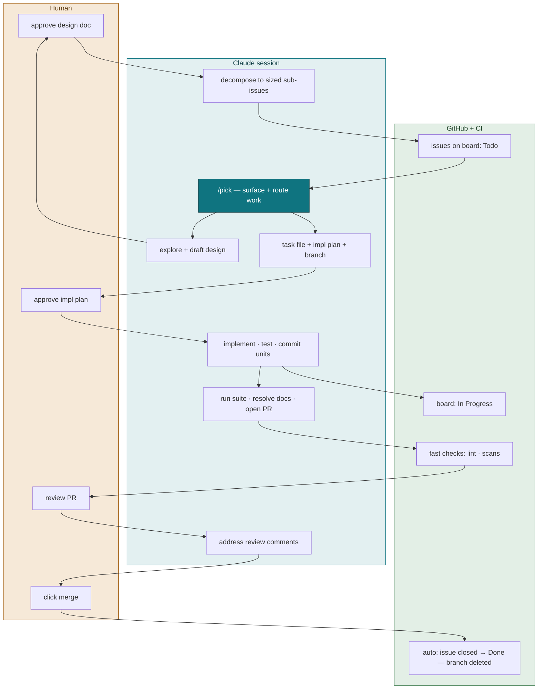
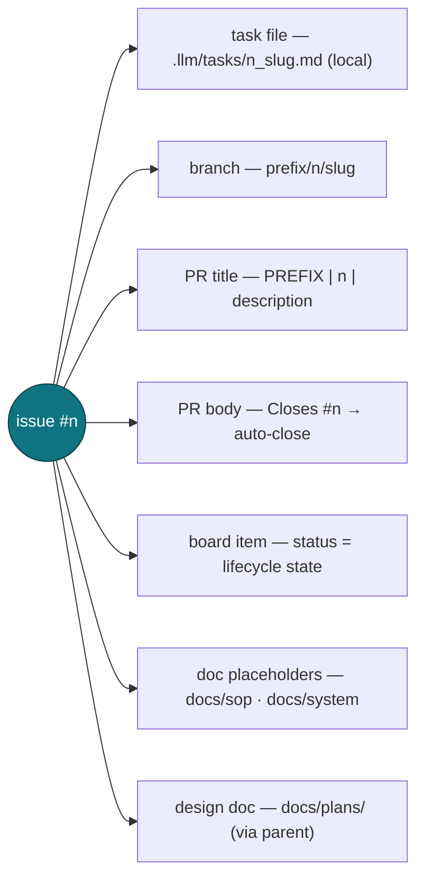

# Dev Workflow — Spec & Diagrams

Command-driven lifecycle for Claude Code + GitHub. Diagrams are mermaid — they render natively on GitHub, GitLab, and VS Code. No external dependencies.

## The chain

```
/pick (entry, routes by state) ⇢ /feature_plan → /task_plan → /implement → /pr_submit → human merge → automation → deploy (per-team SOP)
```

Every command ends by naming the next one — the workflow self-navigates. `/pick` is the entry door, not a chain stage: it surfaces prioritized ready work and routes by item shape + board state.

## 1. Lifecycle master map

The filled node at top is the entry: every session starts at `/pick`. `/feature_plan` feeds new sub-issues back to it. `/segue` is the escape valve off planning and implementation — an isolated discussion thread whose findings merge back without polluting the workstream.



Legend: teal = command · filled teal = entry · amber = human gate · green = automated gate / automation · dashed grey = optional / out of core.

## 2. Board state machine

GitHub issues + Projects board is the single state home. Commands fire the transitions; the final one is repo automation, not a command. State lives in GitHub — never in a session's memory.



## 3. Swimlanes and gates

Human touches are few and high-leverage: two approvals, one review, one merge click. Everything crossing into the human lane is a gate.



## 4. The thread ID

The linchpin. One issue number connects every artifact, which is what lets each command resolve state from scratch — any session, any machine, no handoff notes.



## 5. Tiers

| Tier | Contents |
|---|---|
| **Core** (ships as-is) | `/pick`, `/feature_plan`, `/task_plan`, `/implement`, `/pr_submit`, `/pr_review`, `/pr_qa`, `/update_docs` + 4 gates + conventions |
| **Optional** (adopt piecemeal) | `/segue` ×5, `/pr_comment_resolver`, `/pr_fix_ci`, `/test_fix`, `/run_lint` |
| **Parameterized** (wizard fills) | org/repo/board IDs, default branch, branch + PR title prefixes, lint/test/scan commands, CI check names, review label, persona, iteration filter |
| **Per-team slots** | conventions file (CLAUDE.md), deploy SOP |

Inclusion principle: a tool earns a core spot only if a lifecycle gate or transition breaks without it. Everything else is ambient tooling, governed by non-interference (below).

## Contract slots

Exactly one owner per slot. Ambient tooling a team runs (memory systems, indexers, personas, background agents) must not claim authority over any of them — silence competing instructions or don't run the tool.

| Slot | Owner |
|---|---|
| State machine | GitHub issues + Projects board (Todo → In Progress → Up for Review → Done, + Blocked) |
| Resumability artifact | Task files + design docs (local, uncommitted; `/implement` reloads them in any fresh session) |
| Memory home | CLAUDE.md + `docs/` (conventions single-sourced in CLAUDE.md; system knowledge in the 4-dir doc canon) |

## Gates

| # | Gate | Where | Kind | Blocks |
|---|---|---|---|---|
| G1 | Design doc approved | `/feature_plan` | Human | Issue creation — issues are commitment, the doc is a proposal |
| G2 | Implementation plan approved | `/task_plan` | Human | Any code |
| G3 | Local suite green | `/pr_submit` | Automated | Push / PR creation |
| G4 | Review comments resolved | `/pr_submit` + review | Human | Merge |

Soft vs hard: gates are prompt-enforced unless backed by repo settings. Branch protection with required CI turns G3/G4 hard.

**Repo prerequisites:** Projects workflow "item closed → set status Done" enabled · "Automatically delete head branches" enabled · `Closes #N` in every PR body (`/pr_submit` does this).

## Sizing

Grounded in analysis of 100 merged PRs: under 300 added lines merged in a median of 1 day; 600+ took 3. An issue fits when its acceptance criteria fit in ≤5 testable bullets — more is an epic; decompose.

| Size | Added lines | Guidance |
|---|---|---|
| XS | <100 | Fine as-is; consider batching with related work |
| S | 100–300 | Ideal — merges in ~1 day |
| M | 300–600 | Healthy upper bound |
| L | 600–1,200 | Split if possible; expect ~3-day review |
| XL | 1,200+ | Must split, or accept slow and shallower review |

**Scope-escape rule:** mid-implementation forecast passes 600 added lines or new acceptance criteria appear → stop, split a sub-issue, land the current slice clean.

## Command inventory

| Command | Tier | Job |
|---|---|---|
| `/pick` | Core | Entry door: prioritized ready work + context trees; routes epic/unshaped → `/feature_plan`, sized Todo → `/task_plan`, In Progress → `/implement`, Blocked → show blocker. Enforces sizing at the door |
| `/feature_plan` | Core | Explore → design doc (G1) → sized sub-issues + doc placeholders → board Todo |
| `/task_plan` | Core | Read design doc → task file + plan (G2) → branch → In Progress |
| `/implement` | Core | Idempotent resume: load task file, orient, execute, commit per logical unit |
| `/pr_submit` | Core | Suite (G3) → docs complete-or-delete → PR with `Closes #n` → stack footer (`bin/pr-stack`) → comments (G4) |
| `/pr_review` | Core | Reviewer side: full-context diff review |
| `/pr_qa` | Core | Guided manual QA pass, structured report |
| `/update_docs` | Core | On-demand deep doc pass; keeps the index honest |
| `/segue`, `/segue_resume`, `/segue_close`, `/segue_merge` | Optional | Isolated discussion thread; findings-only merge-back |
| `/segue_kill` | Optional | Abandon a dead-end segue: record why it died, skip the merge |
| `/pr_comment_resolver`, `/pr_fix_ci`, `/test_fix`, `/run_lint` | Optional | Utilities called by core commands |
| `/workflow_setup` | Setup | One-time wizard: parameters, conventions, token fill, automation checks |

## Documentation rules

- 4-dir canon: `docs/plans` (design docs), `docs/system` (architecture state), `docs/sop` (procedures), `docs/qa` (manual test guides)
- `.llm/README.md` indexes **committed docs only**; `.llm/tasks/` and `.llm/threads/` are local scratch (gitignored)
- Doc updates happen at defined points only: `/feature_plan` creates placeholders, `/pr_submit` completes-or-deletes them (+ index dupe/dead-link check), `/update_docs` for deep passes
- Never merge a PR leaving a Draft placeholder behind
